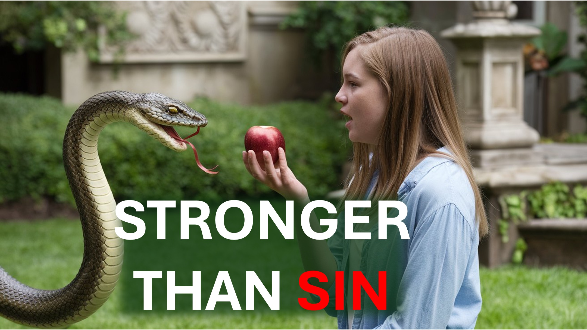

У фільмі 2015 року під назвою "Мордекай", злодій мистецтва, який втратив усе, сказав дружині:

"Ми можемо бути зламаними, моя кохана, але ми не відчайдушні".

Два тисячі років раніше Ісус сказав:

"Хто б не дивився на жінку, вже вчинив з нею перелюб".

це означає, що якщо ти думаєш про гріх, то ти згрішив?

Що сказав Ісус про гріх?

І що має слова Ісуса з фільмом 2015 року під назвою "Mortdecai"?

Відповідь здивує вас.

чути Ісуса.

"Чому для вас так важливий багатий?"

"Це показує, де ваше серце".

"І як ваше серце стало таким?"

"через очі".

"Очі - це вікно тіла".

«Хороші вікна пропускають світло, але погані вікна залишають тіло темним».

"Ми знаємо, що світло, яке отримало тіло, своїми діями"

"Добре тіло зробить добрі справи, тоді як погане тіло зробить погано".

"Знайте, що будь -хто, хто не дає хороших фруктів, буде кинутий у вогонь".

«Знаючи це, слідкуй за мною, бо я світла світу, і кожен, хто слідкує за мною, не буде ходити в темряві».

"Насправді ви вже чисті через слова, які я говорив вам".

Ми підсумовуємо те, що Ісус говорить у 2 реченнях.

Один - гріх трапляється задовго до вчинку.

Два - зосередьтеся на своєму серці на Ісусі, і у вас не буде проблем з гріхом.

Хммм.

Що це стосується фільму 2015 року під назвою "Mortdecai"?

Ну, у цьому фільмі, мистецький злодій, який щойно втратив все, сказав дружині

"Ми можемо бути зламаними, моя кохана, але ми не відчайдушні".

Він сказав це з блискавкою в очах, в той час, коли більшість людей (справді багато християн) були б важкими від відчаю.

Які знання заважали Мордекаї впливати на таку негативну ситуацію?

Які знання змушують вас сумувати в деяких ситуаціях?

Які знання змушують вас грішити в деяких ситуаціях?

Якими б знаннями це було, це було врегульовано у вашому серці, перш ніж ви діяли.

Це те, що Ісус мав на увазі, коли Він вжив слово "вже".

"Хто б не дивився на жінку, вже".

Що вже сталося?

"... вже взяв на себе перелюб".

І де це вже сталося?

"... в його серці".

Хммм.

Якщо втрата великої суми грошей рухає вас або змушує вас реагувати на занепокоєння чи страх, то за правильних обставин ви викрадете гроші.

Крадіжка - це не корінь гріха.

Корінь гріха - це той факт, що гроші мають на вас.

Ось річ.

Це не завжди очевидно, коли «любов до грошей» перекидається у ваше серце.

Це не завжди очевидно, коли дещо інше визначення сексу забивається у ваше серце.

Це не завжди очевидно, коли "довіра до себе" повзає.

Наприклад, у випадку грошей це може почати з вас ідолізуючи успіх, як визначено світом.

Ви дотримуєтесь мирського успіху вище, ніж побожний успіх.

, якщо ви приймаєте інформацію зі світу без фільтра; Тоді ви, як і світ, будете мати мирський успіх високий.

Якщо це так, то враховуючи потрібний час та обставини, ви будете виробляти погані фрукти - як обман чи крадіжка.

Простіше кажучи - коли ви хочете перестати діяти якимось чином, почніть із зміни змісту свого серця. ~~ ~ знову - коли ви хочете перестати діяти якимось чином, почніть із зміни змісту свого серця.

З цими знаннями вам потрібно вивчити своє серце і зняти кожну думку, думку чи аргументи, підняті високо і підняті проти знань Христа.

тоді ви зможете робити добрі справи.

Хммм.

Як витягують думки, які піднімаються проти знань про Христа?

Ось як.

Ісус назвав чіткі очі як самотні.

Це означає мати єдиний фокус; І цей фокус повинен бути правильним.

Пам'ятайте очі - це вікна, і вони повинні бути зосереджені на тому, щоб пропустити світло.

Ісус - це світло.

Зосередьтеся на Ісусі.

Це одне, що ви повинні зробити самостійно; Тому що Бог дав вам вільну волю вибрати, чи впустити світло, чи ні.

Коли ви пропустите світло, світло (тобто Ісус) очистить ваше серце.

Простіше кажучи - вивчіть Ісуса, робіть те, що ви вивчали, повторіть - і ваше серце буде чистим.

Як тільки ваше серце чисте, ви не грішите.

Нарешті, брати і сестри.

Навіть якщо ви провалилися незліченною кількістю разів - не бійтеся.

Будьте втішані правдою, що Бог відповів на питання гріха.

також знайте, що відповідь Бога (Ісус) сильніший за будь -які сумнівні дії.

Цей комфорт (і його надія) - це те, що вам потрібно - щоб тримати свою увагу на Ісусі.

Шалом.

#longervideos #sin #eyes #light #heart #jesus #christian #love #faith #yahweh #god

#viral #foryou #liveabove3d #god #jesus #christianapologetics #loveofgod #faithandraish #BelieveInjesus #ReasonsFaith #EVINDIANGFORGOD #UNDERSTANDINGHRISTIANTION #FAITHVSSCIENCE #SEEKENTRUTH #LogicAndbelief #Christian101 #QuestioningAtheism #DebunkingMyths #godandscience #DiscoveringFaith #Christianliving #HopeScience #DiscoveringFaith #ChristianlIning Виявлення Фейт #christianliving #bless #hope #inspiration #beyondthephysical
