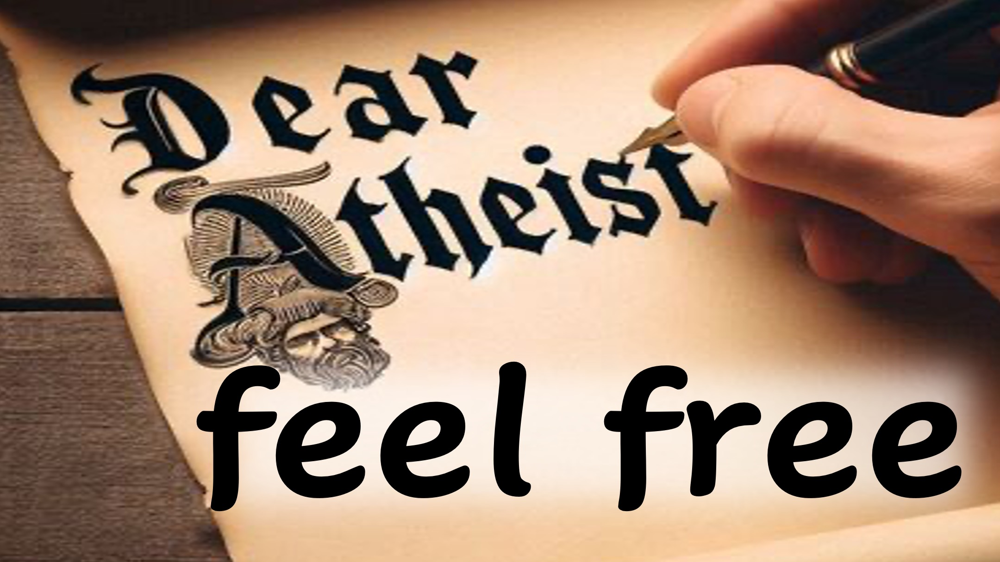

クリスチャンは、あなたがイエスに服従しなければ、あなたは罰せられると言います。

私たちが自由意志で作成された場合、なぜ私たちは提出しないことで罰せられるべきですか？

うーん。

将来の時点で、どちらか：

1  - 神が望んでいること、または

2  - あなたが望むことは起こります。

オプション2は神のない人生です。

神が標準を設定するために、誰でも好きなことをすることができます。

ことは次のとおりです。

強い存在は、この自由を利用して、より弱い人を拷問します。

私たちはそのような場所と呼んでいます - 地獄。

あなたは「これまでで最も賢い政府」の下で生きたいですか？

またはあなたはすべての人のために無料で住みたいですか？

覚えておいてください、あなたは神のイメージで創造されているので、それらの不従順な存在はあなたに彼らの怒りを取り除きます。

これがあなたが神に目を向けることが非常に重要である理由です - 今！

シャローム。

#RIDDLE #ATHEIST #DECIDE #HELL＃HEAVEN #JESUS #CHRISTIAN #LOVE＃FAITH＃YAHWEH #GOD

#VIRAL＃FORYOU3D #truthinchristianity #scienceandfaith #christianityexplained #believeinjesus #reasonsforfhe #evidenceforgod #understandingchristianity #faithvsscience希望#inspiration #beyondthephysical