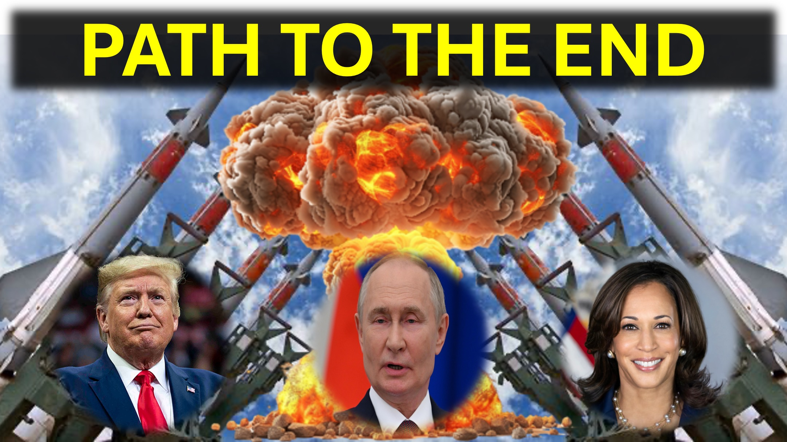

트럼프는 특별한 역할을 가지고 있으며, 당신이 생각하는 것이 아닙니다.

흠.

9 개국에는 핵무기가 있습니다.

이 나라들은 이스라엘과 반대되는 나라로 나뉩니다.

미국, 프랑스, ​​영국 및 인도는 이스라엘을 지원합니다.

러시아, 중국, 파키스탄 및 북한은 이스라엘에 반대합니다.

우리는 적 그리스도 가이 나라들 중 하나를 통해 나타날 것이라고 믿는다.

핵무기를 가진 지도자만이 적 그리스도의 예상대로 세상을 지배 할 수 있습니다.

곧 전쟁이 벌어 질 것입니다. 그의 낙진은 너무 심해서 이스라엘과 실제로 세상이 평화 테이블에 강요 될 것입니다.

미국과 러시아의 지도자들은이 전쟁에서 주요 선수가 될 것입니다.

그 지도자 중 하나는 적 그리스도가 될 수 있습니다.

흠.

미국 대통령은 누구든지 :

어느 쪽이든 - 그 사람은 적 그리스도입니다.

또는 - 그 사람은 적 그리스도에 의해 패배 할 것입니다.

나는 트럼프가 미국의 보안 전문가를 믿는 것보다 푸틴을 믿기 때문에 미국의 패배로 이어지는 것을 본다.

당신은 어떻게 생각하십니까?

의견 섹션에서 알려주세요.

#trump #putin #antichrist #ww3 #nuclearwar #usa

#foryou #liveabeve3d #god #jesus #christianapologeticsetics #loveofgod #truthinchristianity #scienceandfaith #loveofgod #truthinchristianity #loveofgod #Christianitianity # 믿기지스 #ReidentSfaith #EvidenceForGod #이해력 #FaitHvsScience #SeekingTruth #logicandBelief #QuestionInity101 #DeBunkingMyths #GodAndScience #DiscoveringFaith    #Hopecial #hopecient #hopecient

그런 다음 나는 백마를 보았고, 그 위에 앉아있는 사람은 활을 먹었다. 그리고 왕관이 그에게 주어졌고, 그는 극복하고 극복하기 위해 나갔다.

요한 계시록 6 : 2

예언

https://www.youtube.com/watch?v=oclcugcq9_ytch?v=oclcugcq9_y