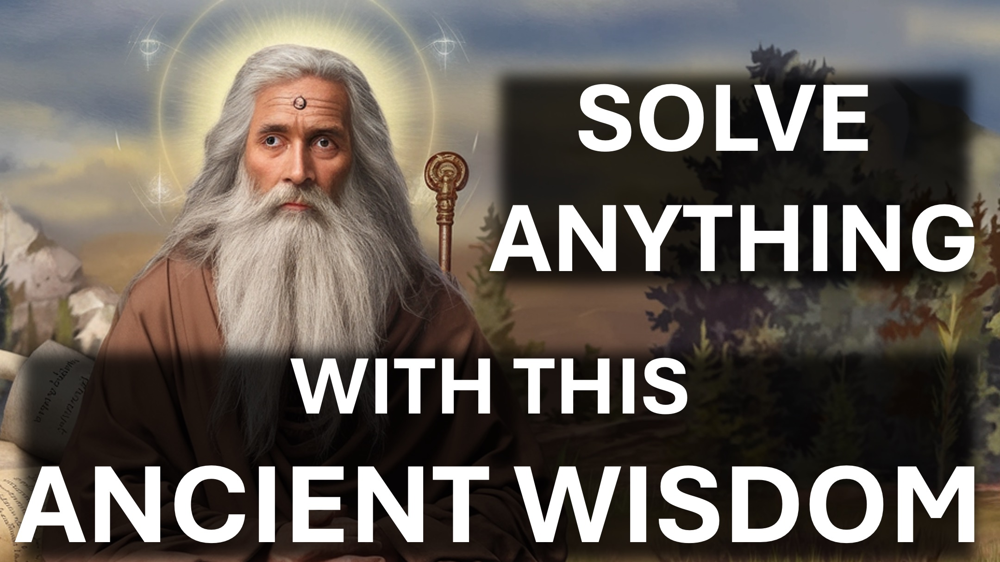

Dieses Video wird Ihre Überzeugungen in Frage stellen.

Hmmm.

Du kommst auf einer kleinen Insel an, auf der jahrelange wissenschaftliche Forschung darauf hindeutet, dass es keine wilden Tiere gibt.

Als du dich für die Nacht bereit machst, hörst du ein lautes Brüllen und siehst, wie der Busch schnell in deine Richtung raschelt.

Was machst du?

Jeder, den ich kenne (einschließlich der Wissenschaftler, die die Insel erforscht haben), wäre erschrocken und würde anfangen, sich zu schützen – nur für den Fall.

Dieses Verhalten nennt man Street-Smarts.

Theoretisch sammeln wir Informationen, um die richtige Wahl zu treffen.

Allerdings ist es oft schwierig, genügend Informationen zu sammeln.

In solchen Fällen müssen wir Straßenklugheit anwenden.

Hier sind 3 solcher Fälle:

Eins – Entweder Gott existiert oder nicht.

Es gibt keinen Nachteil, wenn Gott nicht existiert und wir an Ihn glauben.

Allerdings gibt es einen ewigen und endgültigen Nachteil, wenn Gott existiert und wir ihn ignorieren.

Mit Straßenklugheit entscheiden wir uns also dafür, an Gott zu glauben.

Aber welches?

Zwei – Einige Religionen erlauben die Ausübung anderer Religionen, andere erlauben dies nicht.

Hier ist die Sache.

In welchem ​​Land würden Sie am liebsten das Gesetz brechen?

Eines, in dem alles erlaubt ist, oder eines, in dem das Gesetz hoch respektiert wird.

Wenn Sie in einem Land, in dem alles erlaubt ist, gegen das Gesetz verstoßen, kommen Sie möglicherweise ungeschoren davon.

Wir kommen damit durch, Religionen zu ignorieren, die es uns ermöglichen, andere zu praktizieren, aber wir kommen nicht damit durch, strenge Religionen zu ignorieren.

Wir bleiben also bei den strengeren Religionen – im Allgemeinen den abrahamitischen Religionen: Judentum, Christentum und Islam.

Aber welches?

Drei – In manchen Religionen verdient man sich seinen Platz bei Gott; in anderen verdient Gott einen Platz für dich.

Willst du dir deinen Platz verdienen; Oder möchten Sie lieber, dass Gott es für Sie erledigt?

Lassen Sie mich im Kommentarbereich wissen, was Sie ausgewählt haben oder wählen werden.

Hmmm.

Bevor Sie antworten, sollten Sie wissen, dass das Christentum die einzige Religion ist, in der Gott Ihnen einen Platz einräumt.

Mit freundlichen Grüßen, informieren Sie sich über das Christentum.

Die wichtigste Entscheidung deines Lebens.

Shalom.

Was du nicht über das Christentum wusstest

Die größte Liebe ist, wenn man sein Leben für seine Freunde hingibt.

Gott zeigte diese Art von Liebe, indem er seinen einzigartigen Sohn zum Sterben gab, damit jeder, der an ihn glaubt, nicht verloren geht, sondern ein göttliches Leben hat.

Der Sohn Gottes (Jesus Christus) hat für deine Sünden gelitten und ist gestorben – die Sündlosen für die Sündigen – damit er dich zu Gott bringen kann.

Hier ist der Grund dafür: Wenn der sündenlose Gott den Tod von Menschen ertragen kann, dann kann der sündige Mensch das Leben Gottes genießen.

Es war ein legaler und gerechter Sieg. Alles was Sie tun müssen, ist es zu akzeptieren, indem Sie an die Person glauben, die für uns den Sieg errungen hat – Jesus den Christus.

BIBELVERSE

Niemand hat größere Liebe als dieser, der sein Leben für seine Freunde hingibt.

Johannes 15:13

Denn Gott hat die Welt so sehr geliebt, dass er seinen eingeborenen Sohn gab, damit jeder, der an ihn glaubt, nicht verloren geht, sondern ewiges Leben hat .

Johannes 3:16

Gott zeigt seine eigene Liebe zu uns, indem Christus für uns starb, als wir noch Sünder waren.

Römer 5,7-8

Denn auch Christus hat ein für alle Mal für die Sünden gelitten, der Gerechte für die Ungerechten, damit er euch zu Gott führe

1. Petrus 3:18

Denn wie durch den Ungehorsam des einen Menschen die vielen zu Sündern ernannt wurden, so auch durch den Gehorsam des Einen die vielen werden zu Gerechten ernannt. Römer 5:19 viral #foryou #LiveAbove3D #god #jesus #ChristianApologetics #LoveOfGod #FaithAndReason #TruthInChristianity #ScienceAndFaith #ChristianityExplained #BelieveInJesus #ReasonsForFaith #EvidenceForGod #Christentum verstehen #FaithVsScience #SeekingTruth #LogicAndGlaube #Christianity101 #Atheismus in Frage stellen #Mythen entlarven #GodAndScience #Glauben entdecken #christliches Leben #selige #Hoffnung #inspiration #BeyondThePhysical

#christlichleben #gesegnet #hoffnung #inspiration #BeyondThePhysical