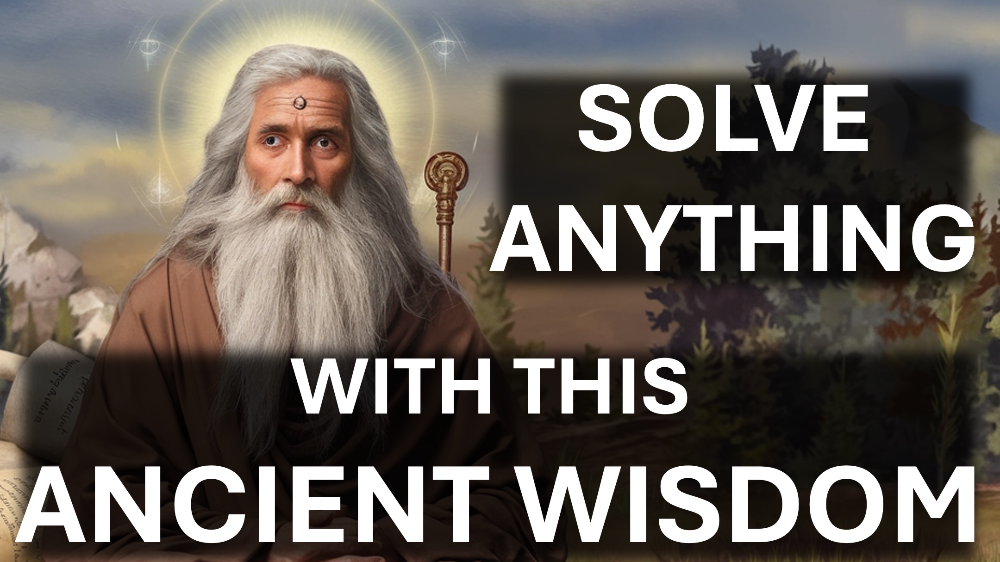

Bu video inançlarınızı zorlayacak.

Hmmm.

Yıllarca süren bilimsel araştırmaların vahşi hayvan olmadığını gösterdiği küçük bir adaya varıyorsunuz.

Geceye yerleşirken, yüksek bir kükreme duyarsınız ve çalıların yönünde hızlı bir şekilde hışırdadığını görürsünüz.

Ne yaparsın?

Tanıdığım herkes (adayı araştıran bilim adamları dahil) şaşıracak ve kendilerini korumaya başlayacak - her ihtimale karşı.

Bu davranış Street Smarts olarak adlandırılır.

Teoride, doğru seçimi yapmak için bilgi toplarız.

Ancak, yeterli bilgi toplamak genellikle zordur.

Bu gibi durumlarda Street Smarts'ı kullanmalıyız.

İşte böyle 3 vaka:

bir - ya Tanrı var ya da olmasın.

, eğer Tanrı mevcut değilse ve ona inanıyoruz.

Bununla birlikte, Tanrı varsa, ebedi ve son bir dezavantaj vardır ve onu görmezden geliriz.

Yani, sokak zekalarını kullanarak Tanrı'ya inanmayı seçiyoruz.

Ama hangisi?

İki - Bazı dinler diğer dinleri uygulamanıza izin verir, bazı dinler buna izin vermez.

İşte bir şey.

Hangi ülkede yasayı çiğnemeyi tercih edersiniz?

Her şeyin gittiği veya yasanın saygı duyulduğu biri.

Yasayı çiğnerseniz, her şeyin gittiği bir ülkede, bundan kurtulabilirsiniz.

Başkalarını uygulamamıza izin veren dinleri görmezden gelmekten kurtulabiliriz, ancak katı dinleri görmezden gelmekten kaçamayız.

Yani, daha katı dinlere sadık kalıyoruz - genellikle İbrahim Dinleri: Yahudilik, Hıristiyanlık ve İslam.

Ama hangisi?

Üç - Bazı dinlerde, Tanrı ile yerinizi kazanırsınız; Diğerlerinde Tanrı sizin için bir yer kazanır.

Yerinizi kazanmak ister misiniz? Yoksa Tanrı'nın bunu sizin için yapmasını ister misiniz?

Yorumlar bölümünde neyi seçtiğinizi veya seçeceğinizi bana bildirin.

Hmmm.

Cevap vermeden önce, Hıristiyanlığın Tanrı'nın sizin için bir yer kazandığı tek din olduğunu bilin.

Saygılarımla, Hıristiyanlık hakkında bilgi edinin.

Hayatınızın en önemli kararı.

Shalom.

Hıristiyanlık hakkında bilmediğiniz şey

En büyük aşk, hayatlarını arkadaşları için bırakmasıdır.

Tanrı, benzersiz bir oğluna ölmek için bu tür bir sevgiyi gösterdi, böylece ona inanan her kişi yok olmayacak, ancak tanrı türüne sahip olacaktı.

Tanrı'nın Oğlu (İsa Mesih) günahlarınız için acı çekti ve öldü - günahkârlar için günahsız - böylece sizi Tanrı'ya getirebilir.

İşte bunun nedeni: eğer günahsız Tanrı insanların ölümüne maruz kalabilirse, günahkar insan Tanrı'nın hayatının tadını çıkarabilir.

Yasal ve adil bir zaferdi. Tek yapmanız gereken, bizim için zaferi kazanan kişiye inanarak kabul etmektir - İsa Mesih İsa.

İncil Ayetleri

Büyük sevginin bundan hiç kimse yoktur, hayatını arkadaşları için bırakır.

Yuhanna 15:13

Tanrı için dünyayı çok sevdi, O'na inanan tek oğlunu verdi, ancak sonsuz yaşamı yoktu.

Yuhanna 3:16

Tanrı bize karşı kendi sevgisini gösterir, çünkü biz henüz günahkarken Mesih bizim için öldü.

Romalılar 5: 7-8

Mesih için de bir kez günahlar için acı çekti, haksız olanlar için doğru, böylece sizi Tanrı'ya getirebilir

1 Peter 3:18

Bir adamın itaatsizliği yoluyla olduğu için birçoğu günahkar olarak atandı, birçoğu doğru olarak atanacak olanın itaatiyle olsa bile.

Romalılar 5:19

#Trending #RiskyDecisions #streetsmarts #WhichReligion #Answers #Christianity #judaism #islam #Atheism

#Viral #Foryou #LiveABove3d #god #jesus #Christianapologetics #LoveOfgod #FaithandReason #truthinchristianity #sciencdfaith #christianitysplaingle #believeInjesus #reasonsforfaith #Faithvsscience #sesking #quingtruth #quinghing #quingtruth #quingtruth #quinghgKing Vescience #discoveringfaith #christianLiving #blessed #hope #inspiration #beyondthePhysical

  #ChristianLiving #blessed #Hope #Inspiration #BeyondThePhysical