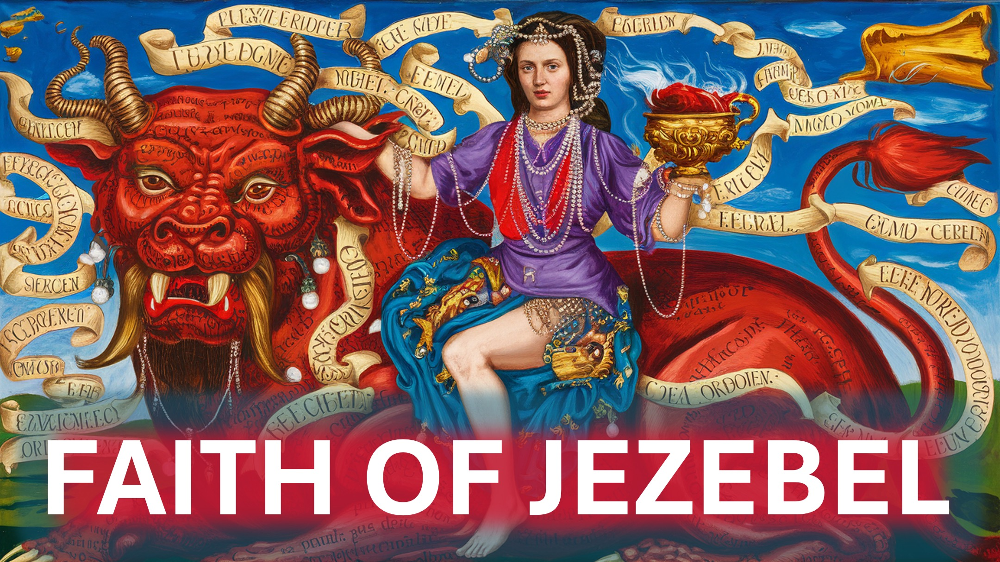

Remember Jezebel - the evil wife of king Ahab, in the bible?

There’s one thing she did better than Elijah - the prophet of Yahweh.

Stick around to find out.

Jezebel worshipped the god, Baal.

Elijah openly disgraced Baal.

Baal could not move or talk, even when mocked.

To make matters worse, Elijah slaughtered 450 prophets of Baal.

No one could recover from such disgrace – not even Baal.

Yet, when Jezebel heard of the disgrace of her god, she sent a message to Elijah, saying:

“May the gods do worse to me, if I don’t disgrace and kill you, by this time tomorrow.”

This was so unexpected that when Elijah heard those words, he ran for his life.

Hmmm.

Your action when you think God has failed matters.

It matters because it is one of the few ways that your faith is tested.

Finally

To be confident after great success - is human.

To be confident after much failure - is divine.

Shalom.

#jezebel #confidence #faith #elijah #kingahab #baal #christianity #pastorchrisoyakhilome #prophetuebertangel #pastorjosephprince

BIBLE VERSE

1 Kings 18:13 – 1 Kings 19:3s 19:3