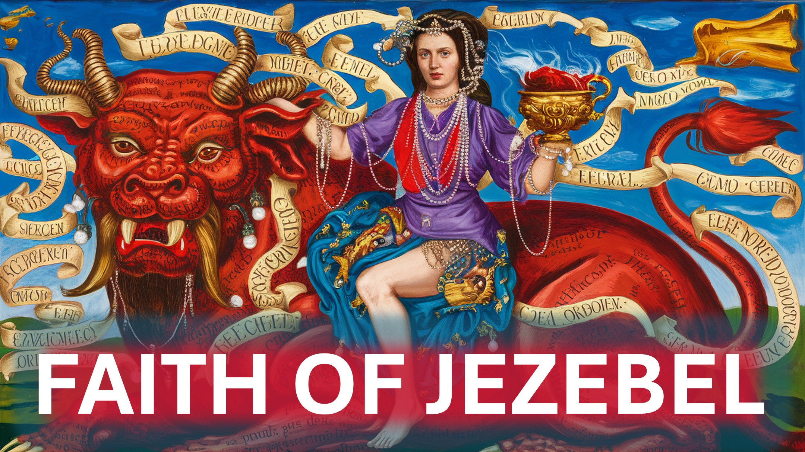

बाइबल में किंग अहाब की बुरी पत्नी - इज़ेबेल याद है?

एक चीज है जो उसने एलिजा से बेहतर किया - याहवे की पैगंबर।

यह पता लगाने के लिए चारों ओर छड़ी।

इज़ेबेल ने भगवान, बाल की पूजा की।

एलिजा ने खुले तौर पर बालों को अपमानित किया।

बाल आगे नहीं बढ़ सकते थे या बात नहीं कर सकते थे।

मामलों को बदतर बनाने के लिए, एलिजा ने बाल के 450 पैगंबर को मार डाला।

कोई भी इस तरह के अपमान से उबर नहीं सकता था - बाल भी नहीं।

फिर भी, जब इज़ेबेल ने अपने भगवान के अपमान के बारे में सुना, तो उसने एलिजा को एक संदेश भेजा, जिसमें कहा गया था:

“देवता मेरे लिए बदतर हो सकते हैं, अगर मैं इस समय तक अपमानित नहीं करता और आपको मार डालता हूं, तो कल इस समय तक । "

यह इतना अप्रत्याशित था कि जब एलिजा ने उन शब्दों को सुना, तो वह अपने जीवन के लिए भाग गया।

हम्म।

आपकी कार्रवाई जब आपको लगता है कि भगवान ने मामलों को विफल कर दिया है।

यह मायने रखता है क्योंकि यह उन कुछ तरीकों में से एक है जो आपके विश्वास का परीक्षण किया जाता है।

अंत में

बड़ी सफलता के बाद आश्वस्त होना - मानव है।

बहुत विफलता के बाद आश्वस्त होना - दिव्य है।

शालोम।

#jezebel #confidence #faith #elijah #kingahab #baal #christianity #pastorchrisoyakhilome #prophetuebertangel #pastorjosephprince

 बाइबिल कविता

1 किंग्स 18:13 - 1 किंग्स 19: 3S 19: 3S 19