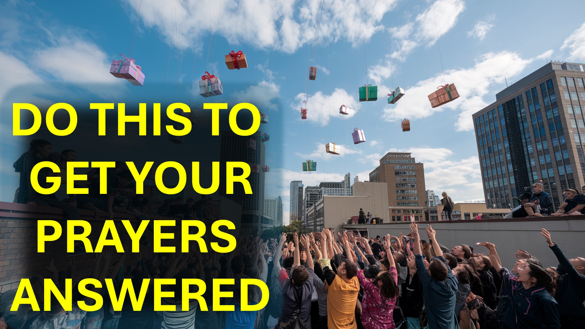

البكاء والتوسل لا يعمل بشكل جيد مع الله.

هنا نذهب.

صرخت إلى يسوع للمساعدة.

لم يرد يسوع.

جمعت الصلوات من المؤمنين الأقوياء إلى يسوع.

أجاب يسوع: "لقد أرسلت فقط إلى الأغنام المفقودة لإسرائيل".

كانت تعبد وتوسلت يسوع للمساعدة. أجاب

يسوع: "ليس من الجيد أن تأخذ خبز الأطفال ورميه على الكلاب".

للمرة الأولى ، سمعت ما قاله يسوع.

جاء الضوء وعرفت ما كان يحظر إجاباتها.

أعطت استجابة حكيمة:

"نعم يا رب ، ولكن حتى الكلاب تتغذى على الفتات التي تسقط من طاولة الماجستير".

أجاب يسوع ثم أجاب: "إيمانك عظيم ؛ يجب أن يتم لك كما يحلو لك. "

في هذه الكلمات ، تلقيت إجابتها.

لذا ، لا تصلي مرارًا وتكرارًا.

توقف - اكتشف ما يقوله الله - ثم الرد بحكمة.

شارك مع شخص يحتاج إلى معرفته - افعله الآن.

#CreatorSearchInsights #funnyvideos #fyp #foryoupage #satispying #kaicenat #speed #ishowspeed #tanyanevergivesup #riverdale #hermionelodge #veronicalodge #riverdaleedits #riverdalescenes ~

آية الكتاب المقدس

متى 15:21 - 28-8 28