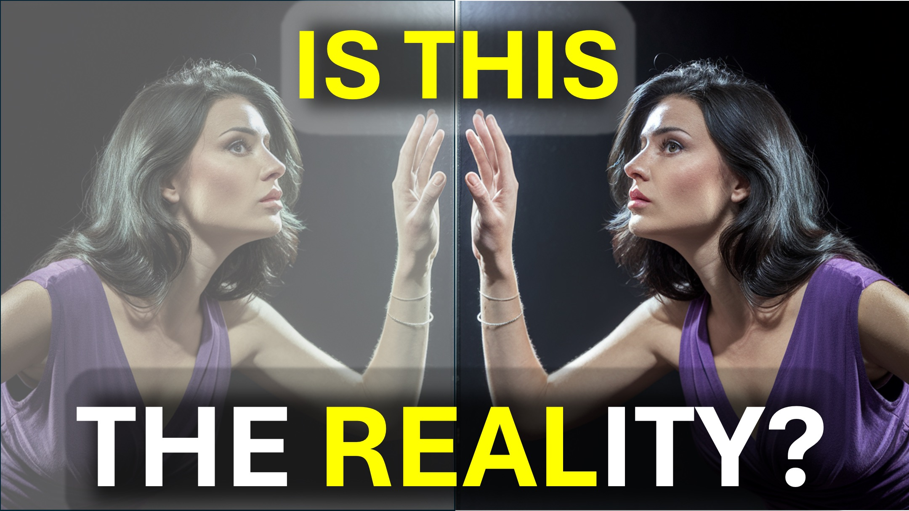

Rappelez-vous ces mots.

«La chose la plus solide peut passer par la chose la moins solide».

Hmmm.

Vous pouvez passer dans l'air.

Encore une fois - «La chose la plus solide peut passer par la chose la moins solide».

Vous pouvez traverser l'air parce que vous êtes plus solide que l'air.

Pensez-y un instant.

«La chose la plus solide peut passer par la chose la moins solide».

Les esprits peuvent traverser les murs.

Le domaine spirituel est plus solide que le monde physique.

a-t-il commencé à avoir un sens?

n'oubliez jamais.

Le domaine spirituel est plus réel que le monde que vous voyez.

Shalom.

# 4D #fourthdimension #SpiriTrealm #TheTruth #wisdom @ReAvelation

#viral #Foryou # liveAbove3d #god #Jesus #ChristianapoGetic Idenceforgod #UnderstandingChristianity #faithVScience #Seekingtruth #LogicandBelief # christianity101 #questioningatheism #DeBunkingMyths #GodAndScience #DiscoveringFaith #ChristianLiv Mindfulness @spacerewind @ Technoplusmedia @cosmoknowledge @ theMessageChannel1 @curiositysp @veritasium @ kapchatfield.07 @ ken.arrington @tedtoks @ the.anonymous.prophet @offthekirb @startalk

#CreatOrSechIship ivesup #RiverDale #HerMionElodge #Veronicalodge #RiverDaleedits #RiverDalenescenes # RiverDaleSeason6 #JustinaFtereFects #fyp #viralal

