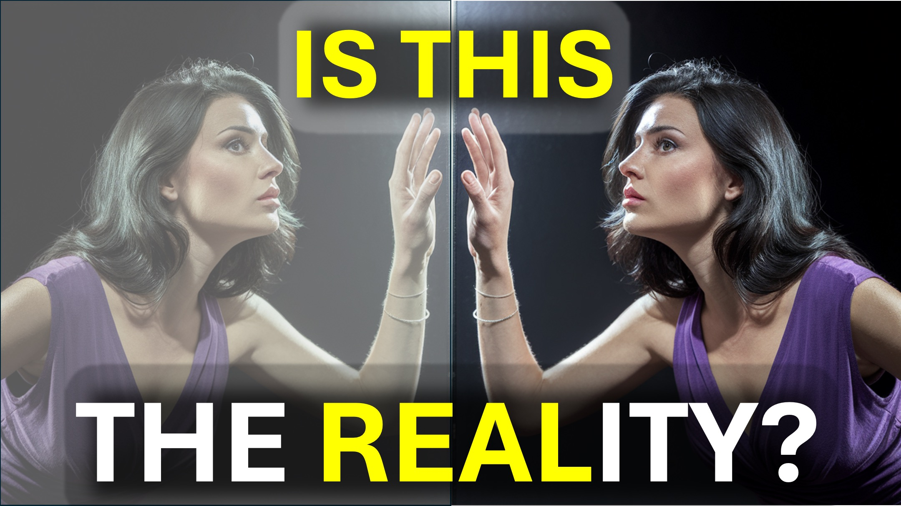

इन शब्दों को याद रखें।

"अधिक ठोस चीज कम ठोस चीज़ से गुजर सकती है"।

हम्म।

आप हवा से गुजर सकते हैं।

एक बार फिर - "अधिक ठोस चीज कम ठोस चीज़ से गुजर सकती है"।

आप हवा से गुजर सकते हैं क्योंकि आप हवा से अधिक ठोस हैं।

एक पल के लिए उस बारे में सोचें।

"अधिक ठोस चीज कम ठोस चीज़ से गुजर सकती है"।

आत्माएं दीवारों से गुजर सकती हैं।

आत्मा क्षेत्र भौतिक दुनिया की तुलना में अधिक ठोस है।

क्या यह समझ में आने लगा है?

कभी मत भूलना।

आत्मा क्षेत्र उस दुनिया से अधिक वास्तविक है जिसे आप देखते हैं।

शालोम।

#4d #fourthdimension #spiritrealm #thetruth #wisdom @revelation

#viral #foryou #liveabove3d #god #jesus #christianapologetics #loveofgod #faithandreason #chithiveasianity #scienchristianity #scienchristianityitying idenceforgod #understandingchristianity #faithvsscience #SeekingTruth indfulness @spacerewind @ technoplusmedia @Cosmoknowledge @themessagechannel1 @CuriositySp @veritasium @kapchatfield.07 @ken.arrington @tedtoks @the.anonymous.prophet @offthekirb @StarTalk

#creatorsearchinsights #funnyvideos #fyp #foryoupage #satisfying #kaicenat #speed #ishowspeed #Tanyanevergivesup #RiverDale #HermioneLodge #Veronicalodge #RiverDaleEdits #RiverDaleScenes #RiverDaleSeasone6 #justinaftereffects #fyp #viralal

