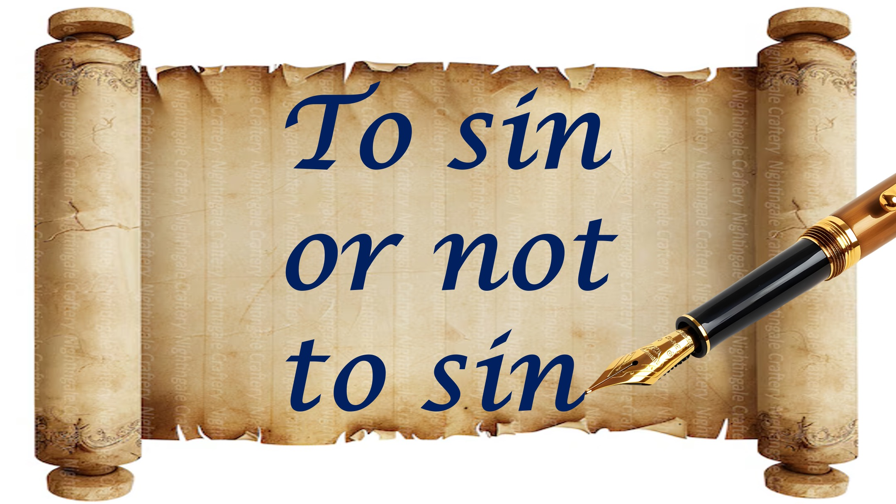

Caro cristiano,

Gesù ha pagato il costo di tutti i nostri peccati, anche i nostri peccati futuri.

Questo significa che dovremmo peccare?

hmmm.

Se il presidente promette di perdonare tutti i tuoi reati, non importa cosa o quando - dovresti commettere reati?

Penso di no.

Vedi, Dio ha pagato il costo di tutti i nostri peccati, in modo da poter scegliere liberamente di vivere nel modo giusto.

Dovremmo scegliere di vivere nel modo giusto,

Non per la paura di pagare il costo del peccato,

ma perché sappiamo che il peccato rende il mondo un posto peggiore.

C'è di più.

Vedi, gli umani non possono vivere senza peccare, quindi Dio ci ha dato il suo spirito per aiutarci.

Chiunque si permetta di essere guidato dallo Spirito di Dio, può vivere per sempre senza peccato.

Dio sta raccogliendo tutti quelli che soddisfano questo requisito.

Il requisito per un regno eterno di giustizia, pace e gioia.

Shalom.