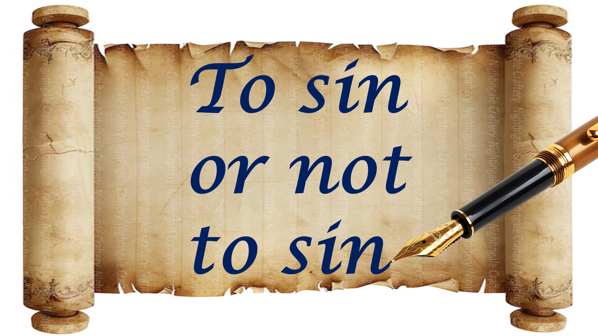

친애하는 그리스도인,

예수께서는 우리의 모든 죄, 심지어 미래의 죄의 비용을 지불하셨습니다.

이것이 우리가 죄를 지어야한다는 것을 의미합니까?

흠.

대통령이 무엇을 또는 ​​언제든 상관없이 모든 범죄를 용서하겠다고 약속한다면 - 범죄를 저지해야합니까?

나는 생각하지 않는다.

알다시피, 하나님께서는 우리의 모든 죄의 비용을 지불하여 우리가 자유롭게 올바르게 살기로 선택할 수 있도록했습니다.

우리는 올바른 살기로 선택해야합니다.

죄의 비용을 지불하는 것에 대한 두려움 때문에

가 아니라 죄가 세상을 더 나쁜 곳으로 만들고 있다는 것을 알고 있기 때문입니다.

더 있습니다.

, 인간은 죄없이 살 수 없으므로 하나님께서는 우리에게 우리를 도와 주셨습니다.

자신을 하나님의 영에 의해 인도 할 수있게하는 사람은 누구나 죄없이 영원히 살 수 있습니다.

하나님은이 요구 사항을 충족시키는 모든 사람을 모으고 계십니다.

영원한 의의, 평화와 기쁨의 왕국에 대한 요구 사항.

샬롬.