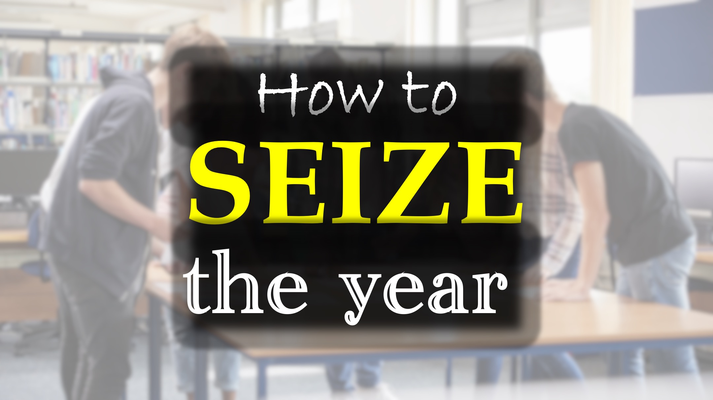

هناك خطط

تجعلك قلقًا

أن تجعلك غاضبًا

أن تجعلك تكره

"لا تقلق أبدًا ،

بدلاً من ذلك ، صلي واسأل

الله  الرب يقاتل من أجلك.

exodus 14:14

كما تشاهد ، ستزداد الانحرافات ؛

كن صبورًا!

"في صبرك ، امتلك روحك"

Luke 21:19

Shalom

  

   من البطيء في الغضب

هو أفضل من القوي ،

وهو الذي يحكم روحه

من الذي يلتقط المدينة.

الأمثال 16:32

هل تعلم أن:

هذا العالم هو ظل العالم الحقيقي؟ https://www.youtube.com/shorts/ktxxls7869o

وهناك حاكم قادم للعالم؟ https://www.youtube.com/shorts/a6bnwnbpgwe