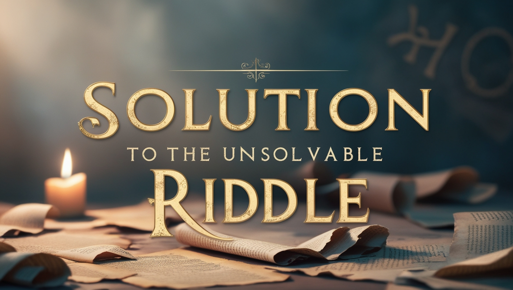

Du hast es also vermasselt.

Du hast dich in große Schwierigkeiten gebracht.

Ein Mafiaboss ist hinter dir her.

Oder ist es das Gesetz, das dich verfolgt?

Oder ein spirituelles Problem – das kein Ende nehmen will.

Sie haben Ihr Bestes gegeben, um dieses Problem zu lösen.

Du bist erschöpft.

Hmmm.

Hier ist Hoffnung – was Gott zu dir sagt:

„Kann den Mächtigen die Beute genommen werden?“

„Können die rechtmäßig Gefangenen befreit werden?“

Gott sagt: „Sogar diejenigen, die von den Mächtigen gefangen genommen werden, werden weggebracht werden.“

„Und die Beute des Tyrannen wird befreit.“

„Denn ich werde mit dem streiten, der mit dir streitet.“

„Und ich werde deine Kinder retten.“

Jesaja Kapitel 49 Verse 24 und 25.

Shalom