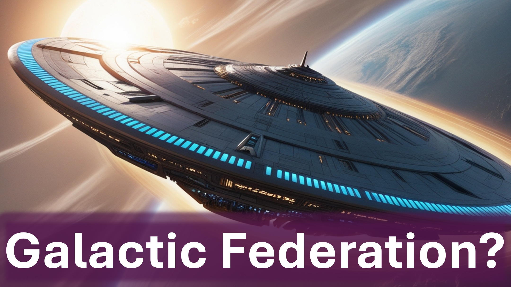

Eine Galaktische Föderation?

Nein – ein Rat der Heiligen.

Lichtträger - Morgensterne.

Lebewesen - Cherubim, Seraphim.

Söhne Gottes, Wächter.

Erzengel, Engel.

Hmmm.

Die sechstausend Jahre der Selbstverwaltung der Menschheit sind vorbei.

Unsere Besitzer kommen; zu urteilen.

Je näher die Erde dem Gericht kommt, desto mehr wird die vierte Dimension (oder Geisterwelt) offenbart.

Diese Entscheidung erfolgt durch den Beschluss der Wächter und das Urteil durch das Wort der Heiligen, damit die Lebenden wissen, dass der Allerhöchste im Königreich der Menschen herrscht.

Daniel Kapitel 4 Vers 17

Diejenigen, die es wissen – wissen es.

Diejenigen, die das nicht tun – sagen, es gibt keinen Gott, keine Außerirdischen, keine Geister.

Doch die Uhr tickt.

Folgen Sie uns, um mehr über die Zukunft der Menschheit zu erfahren.

Shalom.

#diorbag ​​#galaktischeföderation #menschheit #urteil #himmelsrat #heiligkeit