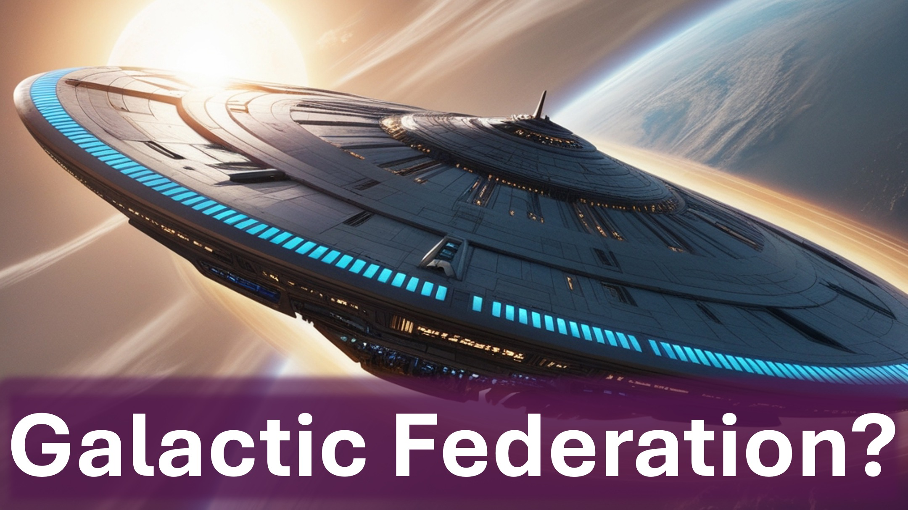

銀河連盟？

いいえ - 聖なるものの評議会。

ライトベアラー - 朝の星。

生きている生き物 - チェルビム、セラフィム。

神の息子、ウォッチャー。

Arch Angels、Angels。

うーん。

人類の6000年の自己ルールは終わりました。

私たちの所有者が来ています。 判断する。

地球が判断に近いほど、

4番目の次元（またはスピリットワールド）が明らかになります。

この決定は、ウォッチャーの命令と、聖なる者の言葉による刑によるものです。

ダニエル第4節17節

知っている人 - 知っています。

そうでない人 - 神、エイリアン、精神がないと言う。

しかし、時計は刻々と過ぎています。

人類の未来についてもっと学ぶために私たちに従ってください。

シャローム。

#diorbag​​ #galacticfederation #humanity #judgement #councilofheaven #holyoness