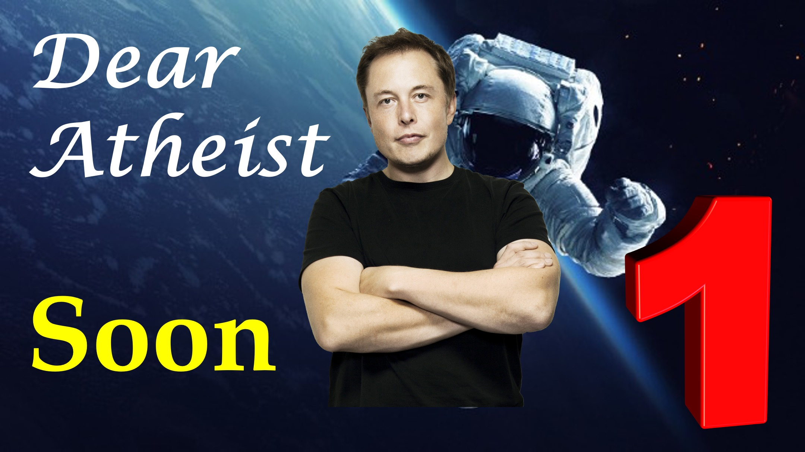

Cher athée

Au cours des prochaines années, les humains seront progressivement exposés à des réalités non humaines.

La même chose que les différentes religions ont dit existent.

Lorsque cela se produit, vous (être athée, croira), car l'exposition proviendra de sources de confiance, comme le gouvernement et les scientifiques.

Voici ce que vous devez savoir.

Cette exposition sera forcée, car l'événement préfabriqué le plus catastrophique serait sur le point de se produire.

L'exode masse de ceux qui croient en Jésus.

Je sais que vous ne croyez pas en Dieu, mais restez un peu avec moi - vous devez entendre cela.

Notez que je n'ai pas dit: Exode des chrétiens.

Pensez-y.

Des millions de toutes les ethnies et religions disparaîtront de la terre.

Lorsque cela se produit, voici la question que vous devez vous poser:

Voulez-vous faire confiance aux dirigeants de ce monde?

ou voulez-vous faire confiance à Jésus, qui est mort pour vous et dont le seul commandement est l'amour?

Faites le bon choix.

Le choix le plus important de votre vie.

https://www.youtube.com/shorts/qasn_c5bpow