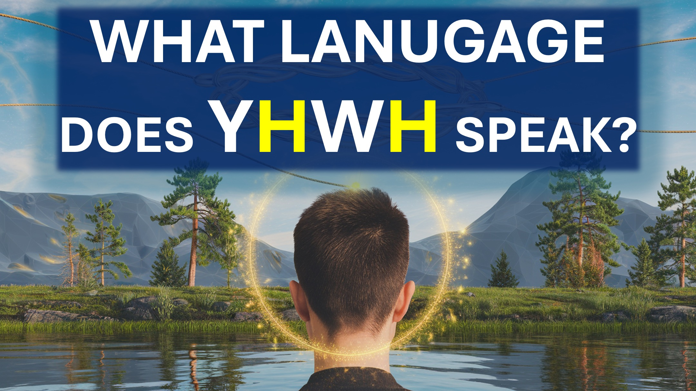

প্রফুল্লতা কোন ভাষায় কথা বলে?

ভুল প্রশ্ন।

এই প্রশ্নটি মানুষের যেভাবে যোগাযোগ করে তা যোগাযোগের কথা ভাবছে।

তবে, God শ্বরের ধরণের যোগাযোগ রয়েছে।

God শ্বর বলেছেন যে যে কেউ খ্রীষ্টের সাথে যোগ দিয়েছেন তা এক আত্মা।

God শ্বর আরও বলেছেন যে এই জাতীয় ব্যক্তির খ্রিস্টের মন রয়েছে।

এর অর্থ কী?

জড়িত - এর অর্থ এটাই। Science

হুমম।

সুতরাং, God শ্বর আপনার সাথে যোগাযোগ করেন; তিনি আপনাকে কী করতে চান তা বুঝতে পেরেছেন - এবং এটি করুন।

তারপরে একদিন - নীরবতা।

নীরবতার দিনগুলি হ'ল আপনি God শ্বরের সাথে কীভাবে জড়িয়ে পড়েছেন তা পরীক্ষার দিনগুলি।

God শ্বরের কাছ থেকে কোনও যোগাযোগ না করে, আপনি know শ্বর কী করবেন তা জানতে পারবেন - এবং এটি করবেন।

যে আমার বন্ধু - এটি আধ্যাত্মিক জড়িত।

বাইবেল আয়াত

যিনি নিজেকে প্রভুর সাথে যোগ দেন তিনি তাঁর সাথে এক আত্মা।

1 করিন্থীয় 6:17

কারণ প্রভুর মনকে কে জানেন, তিনি তাকে পরিচালিত করবেন? তবে আমাদের খ্রিস্টের মন আছে।

1 করিন্থীয় 2:16

#মিন্ডোফ্রিস্ট #স্পিরিটাল্যাঙ্গুয়েজ #গডল্যাঙ্গুয়েজ #এন্ট্যাংলমেন্ট #কমিউনিকেশন #জাইন্ডটোথস্পিরিট #ক্রিস্ট #হোলিসপিরিট #স্পোকাইঅ্যাকশনএডিস্ট্যান্সস্ট্যান্স