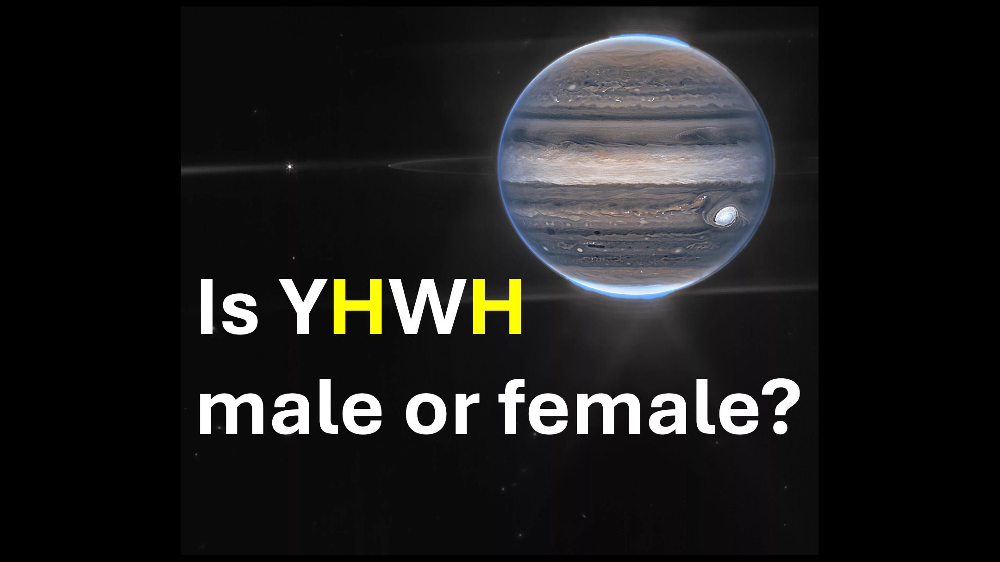

Ist Gott männlich oder weiblich? - Warten Sie, ist er beide? - oder etwas anderes?

Hmmm.

In Genesis 1 Vers 26 sagte Gott:

lass uns den Menschen wie wir aussehen und handeln.

das war vor Eva geschaffen.

Denken Sie daran, dass Eva später aus Adam geschaffen wurde.

Dies bedeutet, dass Eva zu der Zeit, als Gott über das Schaffen von Menschen sprach, immer noch ein Teil von Adam war.

diese Person, die sowohl Adam als auch Eva enthielt - ist das Bild Gottes.

Also, ob männlich oder weiblich-wir sind alle Gott-Sachkind-eine Rasse von Göttern.

, dass meine Freunde eine Offenbarung sind, nach der wir leben sollten.

Shalom.

Bibelverse

Dann sagte Gott, lass uns den Menschen nach unserer Bildheit nach unserem Bild machen, so dass sie über den Fisch des Meeres und über die Vögel des Himmels und über das Vieh und über die Vögel des Himmels herrschen. Die ganze Erde und über jedes kriechende Ding, das sich auf die Erde kriecht. - Genesis 1: 26

Ich sagte, du bist Götter, und ihr alle sind Söhne der Höchsten. - Psalm 82: 6

Jesus antwortete ihnen, wurde es nicht in deinem Gesetz geschrieben, "ich sagte, du bist Götter?" - John 10:34

#GENDER #GOD #YHWH #MALE #FEMALE #GODKINDS #IMAGEOFGOD