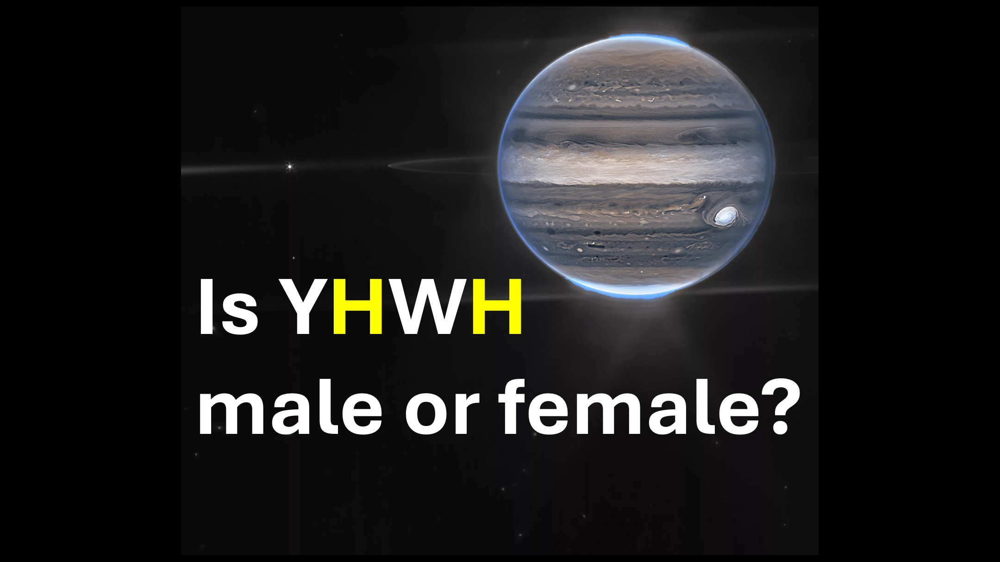

神は男性ですか、それとも女性ですか？ - 待って、彼は両方ですか？ - または何か他のもの？

うーん。

創世記1節26節神は言った：

私たちに人を見て、私たちのように振る舞わせてください。

それはイブが作成される前でした。

イブは後にアダムから作成されたことを忘れないでください。

これは、神が人間を創造することについて話したとき、イブはまだアダムの一部だったことを意味します。

アダムとイブの両方を含むその人は、神のイメージです。

だから、男性であろうと女性であろうと - 私たちは皆、神系です - 神の種族。

私の友達が私たちが生きるべき啓示であること。

シャローム。

聖書の詩

それから神は言った、私たちの肖像に従って私たちのイメージの中で人を作ってみましょう。 空と牛の上、そして地球上で、そして地球上で忍び寄るすべての忍び寄るものの上。 - 創世記1：26

私は言った、あなたは神々であり、皆さんは最も高い息子です。 - 詩編82：6

イエスは彼らに答えました、それはあなたの法律で書かれていませんか？ - ジョン10:34

#gender #god #yhwh #male #female #godkinds #imageofgod