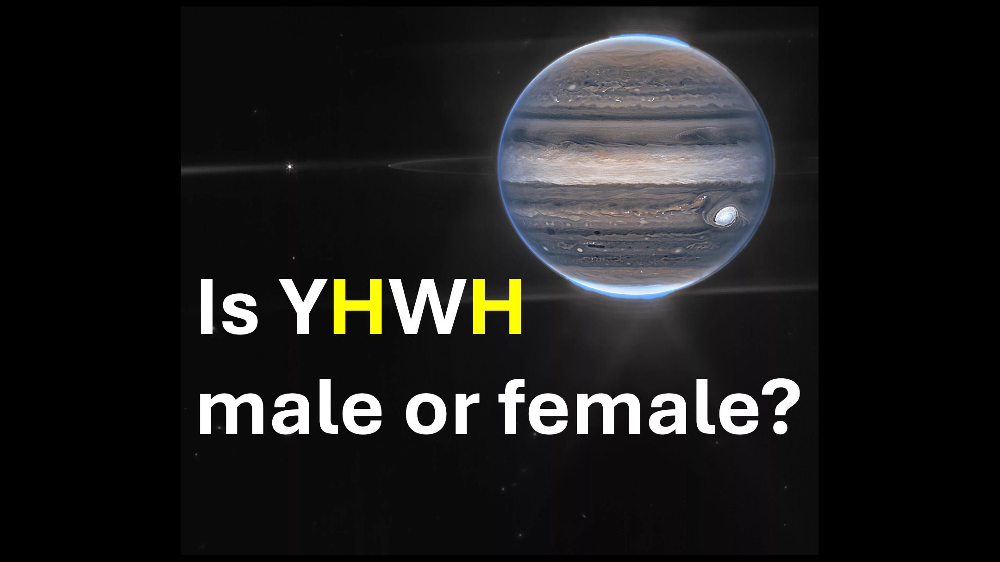

Tanrı erkek mi kadın mı? - Bekle, ikisi de öyle mi? - yoksa başka bir şey mi?

Hmmm.

Genesis 1'de 26. Ayet 26 dedi:

İnsana bakalım ve bizim gibi davranalım.

Havva yaratılmadan önceydi.

Havva'nın daha sonra Adam'dan yaratıldığını unutmayın.

Bu, Tanrı'nın insan yaratma hakkında konuştuğu zaman, Havva'nın hala Adem'in bir parçası olduğu anlamına gelir.

Hem Adem hem de Havva'yı içeren o kişi Tanrı'nın imajıdır.

Yani, ister erkek ister kadın olsun-hepimiz Tanrı-türleriz-tanrıların ırkı.

Arkadaşlarım, yaşamamız gereken bir vahiy.

Shalom.

İncil Ayetleri

Sonra Tanrı dedi ki, benzerliğimize göre imajımızda insan yapalım, böylece deniz balıkları üzerinde ve kuşların üzerinde egemen olacaklar gökyüzünün ve sığırların üzerinde ve tüm yeryüzünde ve yeryüzünde sürünen her sürünen şey. - Genesis 1: 26

Dedim ki, sen tanrılarsın ve hepiniz en yüksek oğullarsınız. - Mezmur 82: 6

İsa onlara cevap verdi, kanununuzda yazılmadı mı, 'Dedim ki, sen tanrılarsın'? - John 10:34

#Gender #god #yhwh #male #female #godkinds #imageofgod