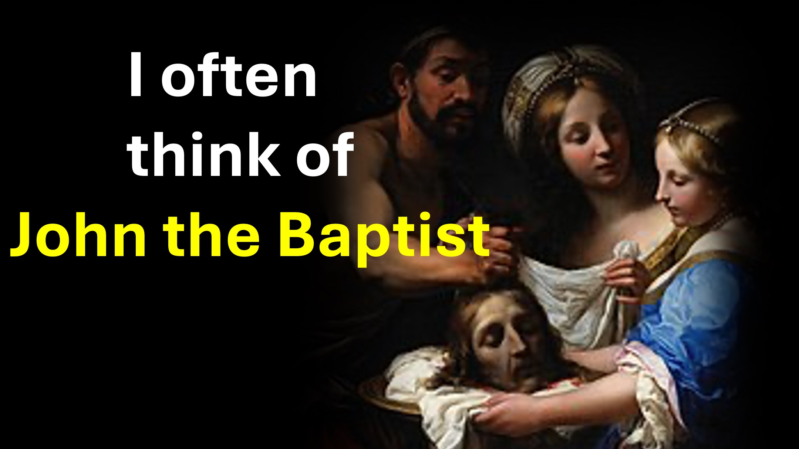

Я часто думаю о Иоанне Крестителя.

он был самым праведным и святым в своем времени.

На самом деле, Иисус сказал:

«Я уверяю вас, что никто не рожден женщиной, которая больше, чем Иоанн Крестителя».

Затем король Ирод Антипа пошел на голову Джона.

Иоанн Крестителя знал, Иисус знал, что небеса знали - все же Иоанн был обезглавлен.

довольно тревожно думать.

Сравните это с тем, что произошло спустя годы после того, как Иисус получил власть и поручил церкви использовать ее.

На этот раз король Ирод Агриппа (другой член геродийской семьи) пошел на голову Петра.

Петр знал, Небеса знали, знал Святой Дух.

, пока Петр был в тюрьме, ожидая, когда его убивают; Церковь горячо молилась.

Петр был спасен.

Вот урок.

Иисус сделал свою роль и передал вам власть (больше, чем у всех Ветхий Пророки).

Это написано: кому много дано, ожидается многое.

Ты, мой друг - ответственны за то, чтобы зло не процветало.

Шалом.

Библейские стихи

Я действительно говорю вам, среди тех, кто рожден женщинами, никого не произошло, чем Джон Крестителя! И все же тот, кто меньше всего в Царстве Небесном, больше, чем он. И со времен Иоанна Крестителя до сих пор Царство Небесное страдает от насилия, и насильственные люди принимают его силой. - Матфея 11:11 - 12

И Иисус подошел и говорил с ними, сказав: «Все власти были даны мне на небесах и на земле. Поэтому иди и сделай учеников всех народов, крестив их во имя Отца, Сына и Святого Духа, учив их сохранять все, что я тебе повелел; И вот, я всегда с тобой, даже до конца возраста ». -Матфея 28: 18-20.

Но тот, кто этого не знал и совершил дела, достойные избиения, получит лишь некоторые из них. От всех, кому было дано много, потребуется много, и кому они поручили много, они будут спросить все больше. - Луки 12:48

Рекомендуемое чтение

• https://read.rhapsodiofrealities.org/

• https: //rhapsodiederrealität.de/lesen  

• https://liveabove3d.com/2024/07/12/en/what-is-a-son-of-god/

• https://liveabove3d.com/2024 /07/12/de/was-ist-ein-sohn-gottes/

Узнайте больше

• Веб-сайт: www.liveabove3d.com

• YouTube : www.youtube.com/@live.above.3d

• tiktok: www.tiktok.com/@live.above.3d

• x: www.x.com/live_above_3d

• reddit: www.reddit.com/user/live-above-3d

• Instagram: www.instagram.com/live.above.3d

• Facebook : www.facebook.com/profile/100092339087423ROFILE.PHP?ID=100092339087423