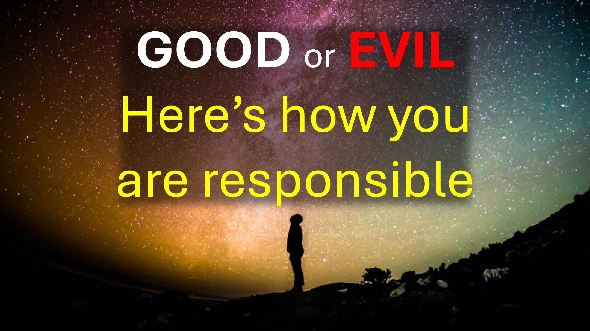

এক রাতে, আমি স্বপ্নে দেখেছিলাম যে আমার লেখার জন্য একটি পরীক্ষা ছিল।

পরীক্ষার সময়, রহস্যজনকভাবে সবকিছু ভুল হয়ে গেছে।

আমার চেয়ারটি খুব লম্বা ছিল, তারপরে পরে খুব ছোট - যাতে আমি লেখার জন্য টেবিলে পৌঁছতে না পারি।

বিভিন্ন অদ্ভুত ঘটনা আমাকে পরীক্ষা লিখতে বাধা দিয়েছে।

তারপরে আমাকে স্বাক্ষর করতে বলা হয়েছিল যে আমি পরীক্ষায় ব্যর্থ হয়েছি।

আমি প্রত্যাখ্যান করেছি।

হুমম।

আত্মার রাজ্যটি খুব আকর্ষণীয়।

এমন কিছু আছে যারা আমি কী ব্যাখ্যা করতে চলেছি তা কখনই বুঝতে পারে না।

আপনি পারেন কিনা তা দেখুন।

---

আমাদের খ্রিস্টান সম্প্রদায়ের এভলিনের ক্যান্সার হয়েছিল।

ডাক্তার তাকে বলেছিলেন যে তিনি মারা যাবেন - তিনি এটি প্রত্যাখ্যান করেছেন।

তারপরে তিনি গির্জার কাছে পৌঁছেছিলেন।

চার্চ প্রার্থনা করেছিল, তারপরে সে আরও খারাপ হয়ে উঠল।

সেই সময়ে যখন সে মারা যাওয়ার কথা ছিল, তখন আমার পরিবার আরও তীব্র প্রার্থনা করেছিল।

এভলিন মারা যায় নি, তবে তিনি সবেমাত্র জীবনে ঝুলছিলেন।

এটি এতটাই স্থায়ী হয়েছিল যে তার ডাক্তার বন্ধু বলেছিলেন: "আমি এত দিন ধরে কাউকে দেখিনি"।

তারপরে আমার সেই স্বপ্ন ছিল, এতে আমি স্বাক্ষর করতে অস্বীকার করেছি যে আমি পরীক্ষায় ব্যর্থ হয়েছি।

আমি যখন জেগে উঠি তখন আমি আমার ফোনটি পরীক্ষা করে এভলিনের কন্যার একটি বার্তা দেখেছি, যে এভলিন মারা গিয়েছিলেন।

আমি তাত্ক্ষণিকভাবে আমার স্ত্রীকে জাগিয়ে তুলেছিলাম এবং তাকে বলেছিলাম: "এভলিন মারা গেছে"।

ধরে রাখুন - এখানে এটি আকর্ষণীয় হয়ে যায়।

দিন পরে, যখন আমরা প্রার্থনা করছিলাম।

পবিত্র আত্মা আমাকে আলতো করে বলেছিলেন:

আপনি যে মুহুর্তে এই শব্দটি উচ্চারণ করেছেন: "এভলিন মারা গেছে", আপনি স্বাক্ষর করেছেন যে আপনি পরীক্ষায় ব্যর্থ হয়েছেন।

সেই শেষ বিবৃতিটি সম্পর্কে ভাবতে কিছুটা সময় নিন।

হুমম।

কেন একজন খ্রিস্টান, যিশুর নামে প্রার্থনা করবেন, তাহলে তাদের প্রার্থনার উত্তর দেওয়া হয়নি বলে মনে করবেন?

আপনাকে বিশ্বাস করা থেকে কী থামছে?

যখন বাইবেল বলে "বিশ্বাসের ভাল লড়াই" - এর মধ্যে প্রতিটি চিন্তাভাবনা ছিঁড়ে ফেলা অন্তর্ভুক্ত, যা আপনাকে বিশ্বাস করা থেকে বিরত রাখে।

এখানে জিনিসটি - আপনি যদি মনে করেন যে ইতিমধ্যে আপনার বিশ্বাস আছে তবে আপনি নিজের মন থেকে ভুল চিন্তাভাবনা ছিঁড়ে ফেলতে পারবেন না।

সুতরাং, আপনার বিশ্বাস আছে কিনা তা আপনি কীভাবে জানেন - বিশ্বাসের ফলাফল হয়।

যদি এটি কাজ না করে - তবে এটি বিশ্বাস নয়।

আমি এটি বলি কারণ, আমি প্রায়শই এই শব্দগুলি শুনি: "আমরা প্রার্থনা করেছি, কিন্তু তিনি মারা গিয়েছিলেন - এটি God শ্বরের ইচ্ছা ছিল"।

সত্যিই? God শ্বর কি বলেছিলেন যে এটি তাঁর ইচ্ছা?

বা আপনি কি ধরে নিয়েছিলেন যে এটি God শ্বরের ইচ্ছা ছিল কারণ আপনার "অবশ্যই" বিশ্বাস ছিল - তবে তিনি মারা গিয়েছিলেন।

মনে রাখবেন: যদি এটি কাজ না করে - তবে এটি বিশ্বাস নয়।

সুতরাং, দায়িত্ব নিন এবং পরবর্তী সাফল্যের জন্য আপনার বিশ্বাস তৈরি করুন।

আপনি জানেন যে এটি আমার জন্যও প্রযোজ্য।

শালম।

#খ্রিস্ট #ফাইথ #লোভ #হিলিং #ডিথ #স্পিরিটুয়াল #ট্রেন্ডিং #পায়ের #প্রাইরফাইথ #স্পিরিট্রিয়ালম #উইলফগড #নেমোফজেসস #Bible

 বিশ্বাসের ভাল লড়াই লড়াই। আপনাকে যে চিরন্তন জীবন বলা হয়েছিল তা ধরে রাখুন এবং আপনি অনেক সাক্ষীর উপস্থিতিতে ভাল স্বীকারোক্তি দিয়েছিলেন। - 1 তীমথিয় 6:12

আমাদের যুদ্ধের অস্ত্রগুলি মাংসের নয়, তবে দুর্গগুলি ছিঁড়ে ফেলার জন্য divine শ্বরিক শক্তিশালী, কারণ আমরা অনুমানগুলি ছিঁড়ে ফেলেছি এবং God শ্বরের জ্ঞানের বিরুদ্ধে উত্থাপিত প্রতিটি উঁচু বিষয় , এবং খ্রিস্টের আনুগত্যের জন্য প্রতিটি চিন্তাকে বন্দী করে নিন। -2 করিন্থীয় 10: 4-5

প্রস্তাবিত rapapsodideeraliittyt.de/Lesen

• ইংরেজি: https://liveabove3d.com/en/welcome/

• Deutch: https://liveabove3d.com/de/de/herzlich-willkommen/  

আরও জানুন

• ওয়েবসাইট: www.liveabove3d.com  • টিকটোক: www.tiktok.com/@live.above.3d -বোভ-3 ডি

• ইনস্টাগ্রাম: www.instagram.com/live.above.3d 

• ফেসবুক: www.facebook.com/profile/100092339087423