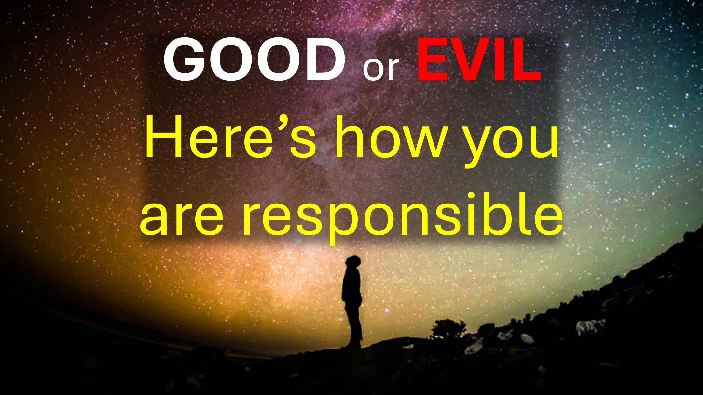

One night, I dreamt that I had a test to write.

During the test, everything mysteriously went wrong.

My chair was too tall, then later too short – so that I could not reach the table to write.

Different strange events prevented me from writing the test.

Then I was asked to sign that I had failed the test.

I refused.

Hmmm.

The realm of the spirit is very interesting.

There are some who may never understand what I am about to explain.

Let’s see if you can.

---

Evelyn from our Christian community had cancer.

The doctor told her she would die – she rejected this.

She then reached out to the church.

The church prayed, then she got worse.

At the time when she was meant to die, my family prayed more intensely.

Evelyn did not die, but she was barely hanging on to life.

This lasted so much so that her doctor friend said: “I have not seen anyone last this long”.

Then I had that dream, in which I refused to sign that I had failed the test.

When I woke up, I checked my phone and saw a message from Evelyn’s daughter, that Evelyn had died.

I immediately woke my wife and said to her: “Evelyn is dead”.

Hold on – here’s where it gets interesting.

Days later, while we were praying.

The holy spirit gently told me:

The moment you uttered the words: “Evelyn is dead”, you signed that you failed the test.

Take some time to think about that last statement.

Hmmm.

Why would a Christian, pray in the name of Jesus, then think that their prayer has not been answered?

What is stopping you from believing?

When the bible says “fight the good fight of faith” – it includes tearing down every thinking, which stops you from believing.

Here’s the thing - you can’t tear down wrong thinking from your mind, if you think you already have faith.

So, here’s how you know if you had faith – faith produces results.

If it did not work – then it’s not faith.

I say this because, I often hear these words: “We prayed, but she died – it was God’s will”.

Really? Did God tell you that it is His will?

Or did you assume it was God’s will because you “definitely” had faith - but she died.

Remember: If it did not work – then it’s not faith.

So, take responsibility and build your faith for the next success.

You know that this also applies to me.

Shalom.

#christ #faith #love #healing #death #spiritual #trending #payer #prayeroffaith #spiritrealm #willofgod #nameofjesus #bible

BIBLE VERSES

Fight the good fight of faith. Take hold of the eternal life to which you were called, and you made the good confession in the presence of many witnesses. - 1 Timothy 6:12

for the weapons of our warfare are not of the flesh, but divinely powerful for the tearing down of strongholds, as we tear down speculations and every lofty thing raised up against the knowledge of God, and take every thought captive to the obedience of Christ. – 2 Corinthians 10:4-5

RECOMMENDED

•	English: https://read.rhapsodyofrealities.org/

•	Deutsch: https://rhapsodiederrealität.de/lesen

•	English: https://liveabove3d.com/en/welcome/

•	Deutsch: https://liveabove3d.com/de/herzlich-willkommen/

LEARN MORE

•	Website: www.liveabove3d.com

•	YouTube: www.youtube.com/@live.above.3d

•	TikTok: www.tiktok.com/@live.above.3d

•	X: www.x.com/live_above_3d

•	Reddit: www.reddit.com/user/live-above-3d

•	Instagram: www.instagram.com/live.above.3d

•	Facebook: www.facebook.com/profile/100092339087423om/live.above.3d/

•	Facebook: www.facebook.com/profile/100092339087423