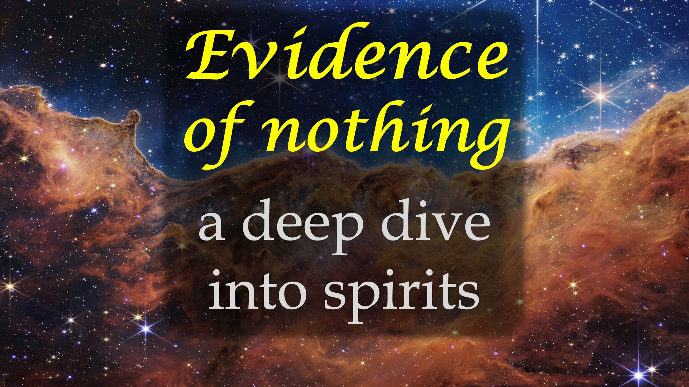

La mayoría de los cristianos piensan que el reino del Espíritu es un lugar esponjoso, aireado, imaginario o semi-real.

¡mal! Muy mal, de hecho, lamentablemente equivocado.

Te sorprenderá descubrir lo que tenemos que decir sobre el reino espiritual y la cuarta dimensión.

No es lo que piensas, así que quédese para averiguarlo.

Aquí vamos.

"La cosa más sólida puede pasar por la cosa menos sólida".

Por ejemplo, puede pasar por el aire.

Puedes pasar por el aire, porque eres más sólido que el aire.

Piense en eso por un momento.

"La cosa más sólida puede pasar por la cosa menos sólida".

Los espíritus pueden caminar a través de las paredes.

Esto significa que los espíritus son más sólidos que el mundo físico.

¿Ha comenzado a tener sentido?

Nunca olvides: el reino espiritual es más real que el mundo que ves.

En teoría, los científicos dicen que la cuarta dimensión es más real que la tercera dimensión en la que vivimos.

Ahora podemos poner dos y dos juntos para estar de acuerdo, que la cuarta dimensión, es el reino espiritual.

Doctor David Yong-Gi Cho, pastor y autor más vendido, escribió al menos 2 libros sobre esto.

One - La Cuarta Dimensión: Descubrir un nuevo mundo de oración respondida.

Dos - Cuarta vida dimensional en un mundo tridimensional.

Le recomendamos que lea esos libros; Pero continúe mirando, hay un punto más importante.

¿Por qué no podemos ver este mundo (más real)?

Bueno, cuando Adán y Eva se comieron lo prohibido, comenzaron a ver más de lo físico y menos espiritual.

Desde entonces, cada vez que un humano enfrenta algunos problemas, ese humano debe elegir entre la solución espiritual y física.

Durante miles de años, los humanos han elegido repetidamente lo físico sobre la solución espiritual.

Esto ha hecho que nuestros cerebros sean más grandes, pero nuestros espíritus ciegos, sordos y peor.

Este es el caso, a pesar de que lo espiritual es más importante que y da a luz al físico.

hmmm.

¿Qué vas a hacer al respecto?

Antes de responder, aquí hay otra pregunta.

entre mil millones de dólares y conocer al creador de todos los reinos, ¿cuál elegiría?

Una vez más, no necesita responder, porque tomas esa decisión cada día, por la forma en que vives.

¿Realmente quieres cambiar las cosas?

Entonces haga menos para sobrevivir o tener éxito y hacer más para conocer a Yahweh Adonai.

también, síganos para mantenernos desafiados.

Dos de las decisiones más importantes de su vida.

Shalom.

Recomendado

La cuarta dimensión: Descubrir un nuevo mundo de oración respondida Dr. David Yong-Gi Cho.
https://www.amazon.de/-/en/fourth-dimension-descubrevering- subwered-combined/dp/1610369998

4th dimensional vive en un mundo tridimensional del Dr. David Yong-gi Cho.
https://www.amazon.de/-/en/4th-dimensional-living-world/dp/1610362276
Inglés: https://read.rubeSodyofRealities.org/

Deutsch: https: // quizásodiedreRealität.de/lesen

inglés: https://liveBove3d.com/en/welcome/

Deutsch: https://liveBove3d.com/de/herzlich-willkommen/

Aprenda más

Sitio web: www.liveBove3d.com

youtube : www.youtube.com/@live.above.3d

tiktok: www.tiktok.com/@live.above.3d

x: www.x.com/live_above_3d

Reddit: www.reddit.com/user/live-above-3d

Instagram: www.instagram .com/live.ABOVE.3d

Facebook: www.facebook.com/profile/100092339087423

#4d #fourthdimension #spiritrealm #thetruth #wisdom @revelation #evidenceforgod #understandingChristianity #ChristianApologetics #faithvsscience #sekinkingtriatt #LogeDBelief #DeBunkingbunking #DiscoveringFaith #ChristianLiving #BeyondThePhysical #CreatorSearchInsights #fyp #ForyOUPAGE #s satisficing #Viral

@live.ABOVE.3D @live_above_3d @live-love-3d @samshamoun @dailydoseOfwisdom @empathetic_mindfure @spacerewind @technoplus @Cosmoknowledge @theSessageChannel1 @curiositysp @veritasium @kapchatfield.07 @ken.arrington @tetoks @the.anonymous.prophet @offthekirb @startalk