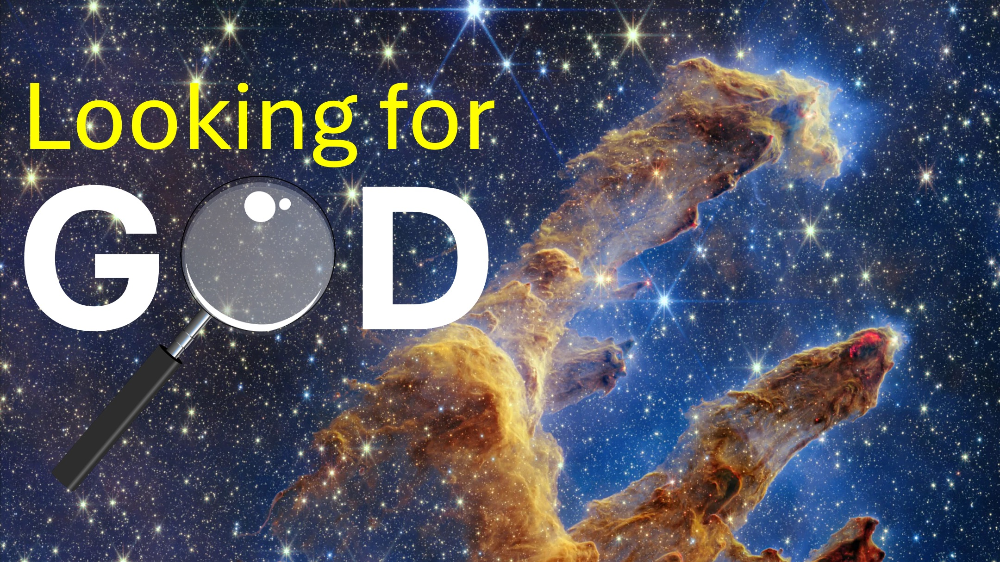

الدين الوحيد في العالم حيث يأتي إله الشخص ويعيش بداخله.

هممم.

أعطيت باحث صيني نسخة من العهد الجديد.

كان قد قرأ الكتب المقدسة من الأديان الشعبية الأخرى.

بعد قراءة العهد الجديد ، سُئل الباحث:

"ما هو الشيء المدهش؟"

كان يعتقد أن الرجل سيقول:

الشيء المدهش الذي قرأته هو أن يسوع ولد من عذراء "

أو" أن يسوع مات وارتفع جسديًا مرة أخرى من بين الأموات ".

بدلاً من هؤلاء ، قال الباحث أن الشيء الأكثر روعة في المسيحية هو في أفسس الفصل 2 الذي يقول:

"في الأوقات الماضية ، مشيت وفقًا لمسار هذا العالم"

"وفقًا لما قاله أمير قوة الهواء"

وفي نهاية هذا الفصل نفسه ، فإنه يقول:

أقول نعم.

ما رأيك ، عزيزي اليهودي ، المسلم ، الهندوسية ، دين آخر؟

#Christ #jesus #yhwh #Chinese #NewTestament #Christianity #Jew #Muslim #Hindu

---

توضح القصة أعلاه اختلافًا رائعًا بين المسيحية والأديان الأخرى في العالم.

آية الكتاب المقدس

الذي يتم بناؤه أيضًا معًا في مسكن من الله بالروح. - أفسس 2:22 (LSB)

جسده ، وهي الكنيسة. - كولوسي 1:24 (LSB)

قم بالوعظ بكلمة الله ، أي اللغز الذي تم إخفاؤه عن العصور والأجيال الماضية ، ولكنه الآن يتجلى في قديسيه (أو القديسين) ، الذي أراد الله له أن يعرف ثروات مجد هذا اللغز بين الوثنيين ، وهو ما يأمل في أن يكون الله في الجمع.

Colossians 1: 25b - 27

الموصى بها

اللغة الإنجليزية: https://read.rassodyofRealities.org/

Deutsch: https: //rishodiederrealität.de/lesen

english: https https://liveabove3d.com/de/herzlich-willkommen/

تعلم المزيد

الموقع الإلكتروني: www.liveabove3d.com

youtube: www.youtube.com/@live.above.3d www.x.com/live_above_3d

reddit: www.reddit.com/user/live-above-3d

instagram: www.instagram.com/live.above.3d

facebook: www.facebook.com/profile/1000923390874233

