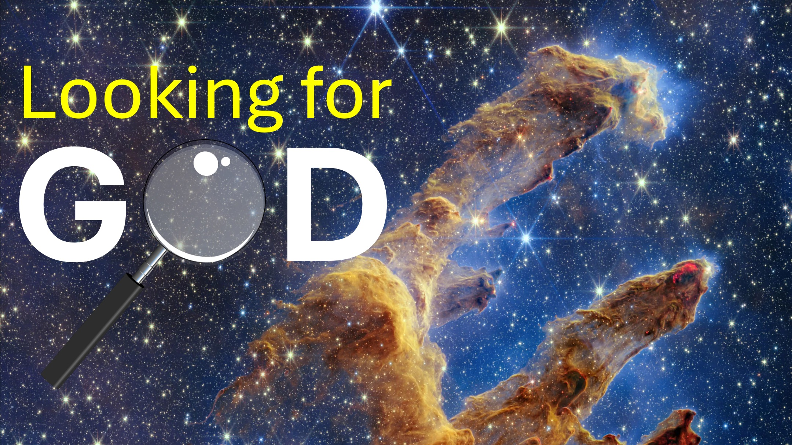

दुनिया में एकमात्र धर्म जहां एक व्यक्ति का ईश्वर आता है और उनके अंदर रहता है।

हम्म।

एक चीनी विद्वान को नए नियम की एक प्रति दी गई थी।

उन्होंने अन्य लोकप्रिय धर्मों से पवित्र पुस्तकों को पढ़ा था।

नए नियम को पढ़ने के बाद, विद्वान से पूछा गया:

"सबसे आश्चर्यजनक बात क्या थी?"

यह सोचा गया था कि आदमी कहेगा:

"सबसे आश्चर्यजनक बात जो मैंने पढ़ी है, वह यह है कि यीशु एक कुंवारी से पैदा हुआ था"

या "वह यीशु मर गया और शारीरिक रूप से फिर से मृतकों से उठ गया"। ~ ~ ~ उन लोगों के बजाय, विद्वान ने कहा कि ईसाई धर्म के बारे में सबसे भयानक बात इफिसियों के अध्याय 2 में है, जो कहता है:

"कई बार, आप इस दुनिया के पाठ्यक्रम के अनुसार चले गए"

"हवा की शक्ति के राजकुमार के अनुसार"

और उसी अध्याय के अंत में, यह कहता है:

"

मैं हाँ कहता हूँ।

आप क्या सोचते हैं, प्रिय यहूदी, मुस्लिम, हिंदू, अन्य धर्म?

#christ #jesus #yhwh #

बाइबिल कविता

जिसमें आप भी आत्मा में ईश्वर के आवास में एक साथ बनाए जा रहे हैं। - इफिसियों 2:22 (एलएसबी)

उसका शरीर, जो चर्च है। - Colossians 1:24 (LSB)

परमेश्वर के वचन के उपदेश को अंजाम देते हैं, अर्थात्, वह रहस्य जो पिछले युगों और पीढ़ियों से छिपा हुआ है, लेकिन अब अपने संतों (या पवित्र लोगों) के लिए प्रकट हो गया है, जिनके लिए यह ज्ञात करने की इच्छा है कि इस रहस्य की महिमा के बीच क्या है।

Colossians 1: 25b - 27

अनुशंसित

अंग्रेजी: https://read.rpsodyofrealities.org/

Deutsch: https: //rpsodiederealität.de/lesen ~ ~ ~ ~ ~ ~ ~ ~ ~ ~ ~ ~ ~ ~ ~ ~ ~ ~ ~ ~ ~ ~ ~ ~ ~ ~ ~ ~ ~ ~ ~ ~ ~ ~ https://liveabove3d.com/de/herzlich-willkommen/

अधिक जानें

वेबसाइट: www.liveabove3d.com

youtube: www.youtube.com/@live.above.3d

tiktok www.x.com/live_above_3d

reddit: www.reddit.com/user/live-above-3d

Instagram: www.instagram.com/live.above.3d

फेसबुक: www.facebook.com/profile/10009233908742323

