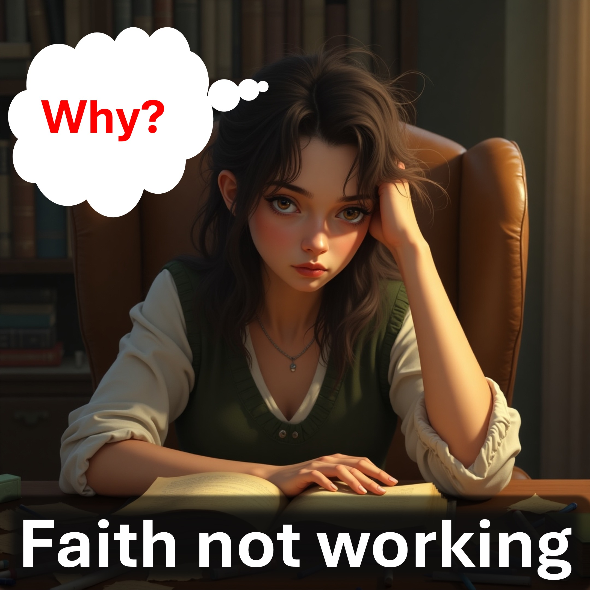

Kann es zu viel Freiheit geben?

du wirst überrascht sein - also bleib dabei, um es herauszufinden.

Nach dem Human Freedom Index ist

der freiste Ort auf der Erde ist die Schweiz. Auch die Freiheit ist mit einer verbesserten Zufriedenheit und Produktivität verbunden.

Hmmm.

Kann es zu viel Freiheit geben?

Ich meine, wenn Sie in der Schweiz ein Verbrechen begehen, werden Sie im Gefängnis landen.

In der Tat gibt es irgendwo freier als die Schweiz.

Hölle ist der einzige Ort, an dem man mit irgendetwas davonkommen kann.

Hölle wird für die stärkste Person in der Hölle ein Vorteil sein.

es wird nicht du sein.

Nur Bürger des Himmels werden in der Hölle nicht enden.

Jeder kann heute Bürger des Himmels werden, indem er Jesus glaubt und unterwirft.

Jesus ging zur Hölle, damit du es nicht musst.

Jesus öffnete auch den Himmel für diejenigen, die zustimmen, andere zu lieben.

Akzeptiere das Angebot Jesu jetzt, indem du das Gebet in der Beschreibung sprach.

Dies ist die wichtigste Entscheidung Ihres Lebens.

Werde ein Bürger des Himmels, indem er dies zu Gott sagt und meint. Ich glaube, dass Jesus ohne Sünde lebte, am Kreuz starb, um für alle meine Sünden zu bezahlen, den Tod zu besiegen und auferstanden zu haben. Ich glaube, dass Jesus mir nach dem Erreichen all dieser Menschen Ihre Art von Leben anbot, um mich vom Tod zu befreien. Ich akzeptiere dein Leben. Danke, Vater. Ich untersuche Ihnen gerne Ihren Einfluss durch Christus heute und für immer mehr. All dies erkläre ich im Namen Jesu.

Bibelvers

für unsere Staatsbürgerschaft ist im Himmel, von der wir auch gespannt auf einen Erlöser warten, den Herrn Jesus Christus. . YouTube: www.youtube.com/@live.above.3d

Tiktok: www.tiktok.com/@live.above.3d

x: www.x.com/live_above_3d

Reddit: www.reddit.com/live/live-above-above-3d

~

~ www.instagram.com/live.above.3d

Facebook: www.facebook.com/profile/100092339087423

