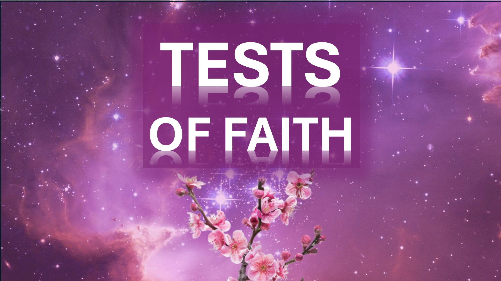

Чем больше я слышу Иисуса, тем больше я понимаю, что никто никогда не будет говорить, как он.

Я слышу, как популярные проповедники учат, как они были почти убиты злыми княжествами.

все же Иисус сказал: «Ничто не повредит тебе».

Что это с Иисусом?

не мог бы он сказал: «Смотри и молитесь, чтобы не повредить вам»?

хммн.

Я слышал, что могущественные проповедь учат, как они постились, и очень долго молились, чтобы стать сильными.

все же Иисус сказал: «Я даю вам силу над всей силой врага».

Что не так с Иисусом?

Разве он не мог сказать: «После того, как вы выполнили мои требования, вы получите мою власть»?

Это либо Иисус, или эти проповедники не правы.

хммн.

Теперь вы думаете: «Но я попробовал это, и это не сработало».

Ну, вот что сказал Иисус.

«Если вы не обратитесь и не станете как дети, вы никогда не войдете в Царство Небесное».

теперь, остановись и думай очень усердно.

Шалом.

! - Луки 10: 19b. (KJV)

вот, я даю вам силу наступить на змей и скорпионов и над всей силой врага. - Луки 10: 19a (kjv)

и сказал, истинно я говорю вам, за исключением того, что вы будете преобразованы и становятся как маленькие дети, вы не войдете в Царство Небесное. От Матфея 18: 3 (KJV)

И Иисус пришел и говорил им, говоря, что вся сила дается мне на небесах и на земле. Поэтому иди и учить все народы, крестить их во имя Отца и Сына и Святого Духа: учить их наблюдать за всем, что я повелел тебе: и, как я всегда, даже до конца света. Аминь. Матфея 20: 18-20

Рекомендуется
https://liveabove3d.com/en/welcome/

www.x.com/live_above_3d

reddit: www.redit.com/user/live-above-3d

instagram: www.instagram.com/live.above.3d

facebook: www.facebook.com/profile/100092339087423

https://leonardo.ai/

Молодая девушка смотрит и слушает вихрь ветра. Винтер должен причинять ущерб вокруг, и в то же время быть нежным рядом с молодой девушкой. Вспышки золота, огня и света должны кружиться вокруг вихря ветра. Винтер должен быть в форме перевернутого конуса, укоренившегося в небольшом спине перед девушкой, но становится все больше и больше, когда он поднимается.

