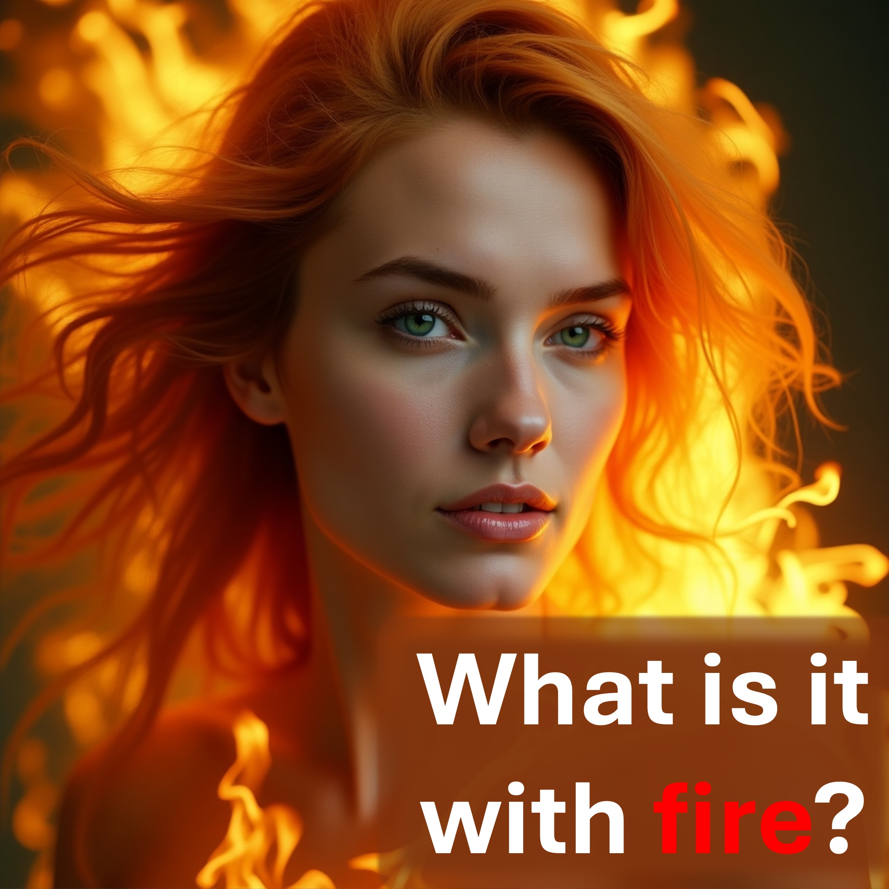

Die Leute beschweren sich über Feuer - Höllenfeuer.

Doch sie verwenden jeden Tag ihres Lebens Feuer.

Siehe - es kommt darauf an.

bist du aus Gold oder bist du aus Holz gemacht?

Feuer reinigt Gold, verbrennt aber Holz.

Hölle Feuer ist nicht das Problem - du bist es.

#fire #gold #wood #hell

Empfohlen

https://liveabove3d.com/en/welcome/

Erfahren Sie mehr

Website: www.liveAbove3d.com

YouTube: www.youtube.com/@live.above.3d

Tiktoktoktok: www.tiktok.com/@live.above.3d

x: www.x.com/live_above_3d

Reddit: www.reddit.com/user/live-above-3d

Instagram: www.instagam.com/live.above.3d

Facebook: Facebook: facebook: facebook: facebook: www.instagram.com/live.3d
Facebook: facebook: facebook: www.instagram.com/live.3d
Facebook: www.facebook.com/profile/100092339087423