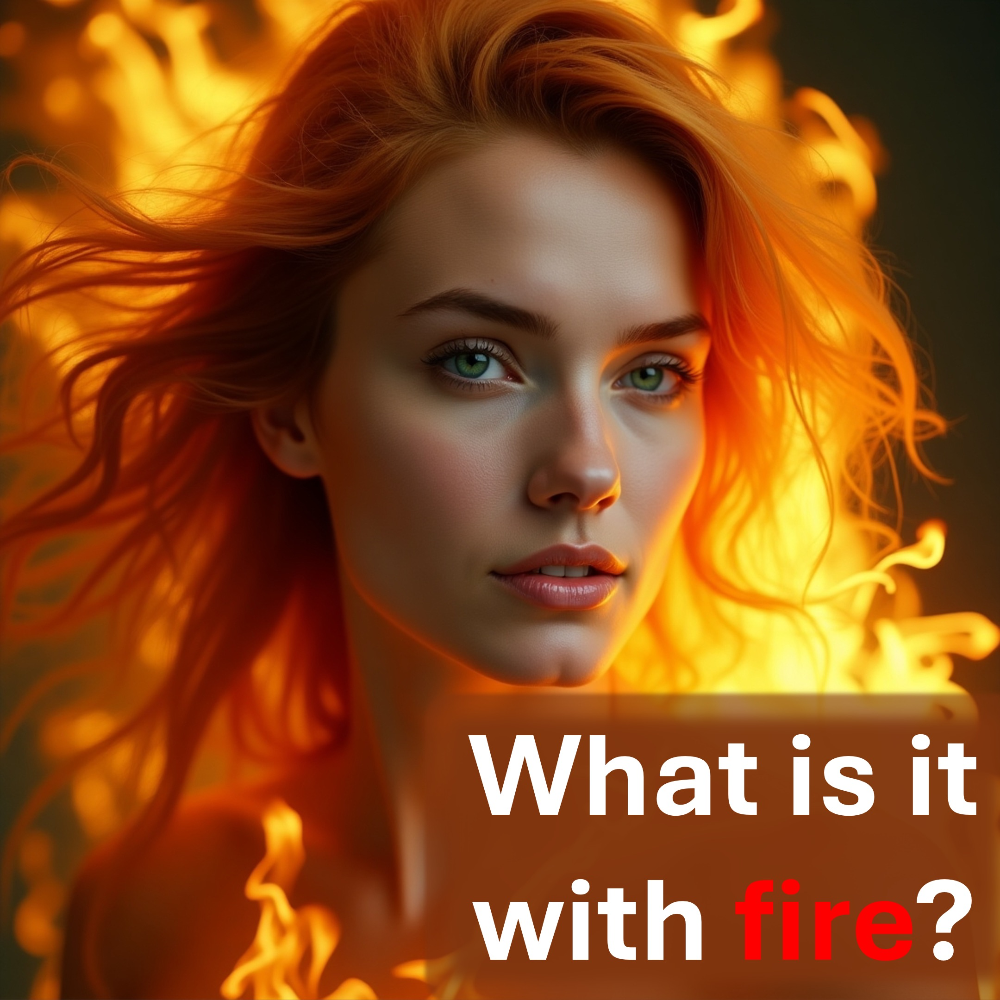

人々は火について不平を言う - 地獄の火。

しかし、彼らは人生の毎日火を使用しています。

参照 - それは依存します。

あなたは金でできていますか、それとも木でできていますか？

火は金を浄化しますが、木材を燃やします。

地獄の火は問題ではありません - あなたはそうです。

#fire＃gold＃wood＃hell

推奨

https://liveabove3d.com/en/welcome/

詳細を学ぶ

ウェブサイト：www.youtube.com/@live.above.3d〜~~ Tiktok

X：www.x.com/live_above_3d

reddit：www.reddit.com/user/live-above-3d

Instagram：www.instagram.com/live.above.3d

Facebook：www.facebook.com/profile/1000923390887423

