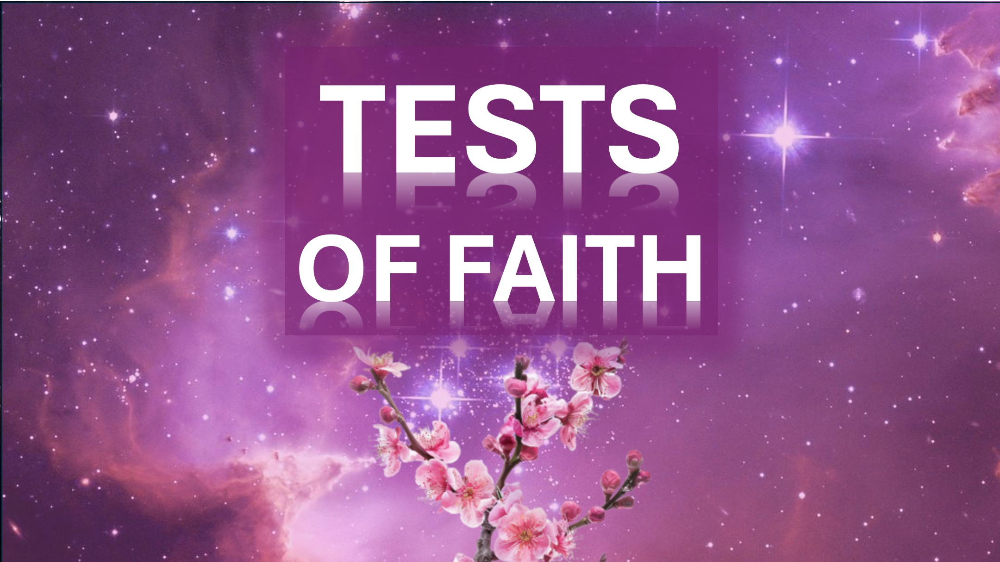

正確に何が起こっているのですか？

あなたが尋ねるべき質問は、あなたにパニックが爪をかけるとき。

あなたの周りのすべてが崩壊しているとき。

すべての希望が失われたように見えるとき。

あなたの魂を抱きしめて考えてください - 正確に何が起こっているのですか？

あなたの最善の努力がクラッシュし、誰もがあなたをオンにして、あなたを非難します。

あなたの魂を抱きしめて考えてください - 正確に何が起こっているのですか？

あなたが拒否され、あなたが愛する人によってひどく扱われたとき。

あなたの平和を握って尋ねる - 正確に何が起こっているのか？

それからあなたは見るでしょう。

それはあなたが渡すべきテストのみであること。

そしてそれも通り過ぎるでしょう。

覚えておいてください、あなたが世界に反応することが少ないほど、あなたは霊に反応することをします。

あなたがあなたの周りの傷ついた世界を癒すためにより多くの神の力を使うことができるように。

シャローム。

#whatisverinon #trouble #hope #panic #trials #peace #reflection #god #heal #hurting

bible verse

兄弟、私の兄弟、あなたの信仰のテストが誠実さをもたらすことを知って、私の兄弟、私の兄弟、私の兄弟、私の兄弟、私の兄弟を考えてください。 そして、忍耐力が完璧な仕事をしてもらいましょう。 - ジェームズ1：2-4（LSB）

神の霊に導かれているのと同じくらい多くの人にとって、彼らは神の息子です。 - ローマ人への手紙8:14（KJV）

生き物の真剣な期待のために、神の息子たちの現れを待っています。 なぜなら、クリーチャーは喜んでではなく、希望にさらされた彼の理由により、虚栄心の対象となったからです。 なぜなら、生き物自体は、腐敗の束縛から神の子どもたちの輝かしい自由へと救われるからです。 ローマ人への手紙8：19-21（KJV）
創造は、神の息子がそれを束縛と腐敗から救うのを待っています。

推奨

英語：https：//read.rapsodyofrealities.org/

deutsch：https：//rapsodiederealität.de/lesen

英語：https：//liveabove3d.com/en/welcome/ ~~ Deutsch： https://liveabove3d.com/de/herzlich-willkommen/

詳細をご覧ください

ウェブサイト：www.liveabove3d.com

YouTube：www.youtube.com/@live.above.3d

tiktok：www.tiktok.tik.tok.bove.3d ~~ x： www.x.com/live_above_3d

reddit：www.reddit.com/user/live-above-3d

Instagram：www.instagram.com/live.above.3d

Facebook：www.facebook.com/profile/100092333908888888888888233333333333333333333339088888888888888888888888888888888888887423

