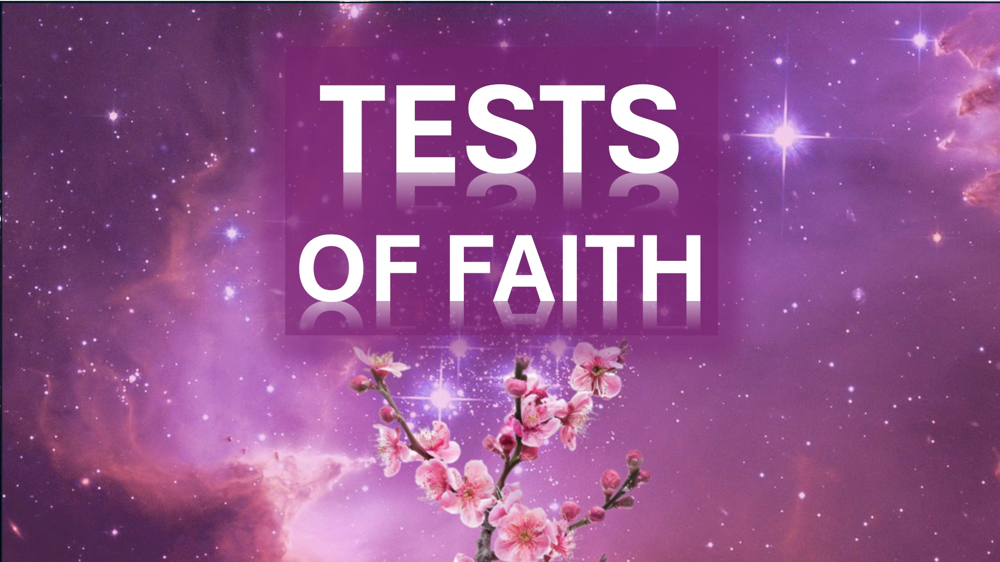

Что именно происходит?

Вопрос, который вы должны задать, когда панические когти на вас.

, когда все вокруг вас рушится.

, когда вся надежда кажется потерянной.

Держите свою душу и подумайте - что именно происходит?

, когда ваше лучшее усилие вылетает, и все поворачивают вас, обвиняя вас.

Держите свою душу и подумайте - что именно происходит?

, когда вас отвергают и плохо обращаются с теми, кого любите.

Держите свой мир и спросите - что именно происходит?

Тогда вы увидите.

что это только тест, который вы должны пройти.

и это тоже сбудется.

Помните, чем меньше вы реагируете на мир - тем больше вы реагируете на дух.

так, чтобы вы могли использовать больше Божьей силы, чтобы исцелить обильный мир вокруг вас.

Шалом.

#WhatisOnOn #Trouble #HOPE #PANIC #Trials #Peace #Reflection #god #Heal #hirting

Библейский стих

Считайте все это радость, мои братья, когда вы сталкиваетесь с различными испытаниями, зная, что тестирование вашей веры приводит к непосредственности. И пусть настойчивость будет иметь свою идеальную работу, чтобы вы могли быть идеальными и полными, не имея ничего. - Иакова 1: 2-4 (LSB)

Ибо столько, сколько во главе с Духом Божьим они являются сыновьями Божьими. - Римлянам 8:14 (kjv)

для серьезного ожидания существа ожидает проявления сыновей Божьи. Ибо существо было сделано подчиненным тщеславию, не охотно, но по причине того, кто подверг то же самое в надежде. Потому что само существо также будет доставлено из рабства коррупции в славную свободу детей Божьи. Римлянам 8: 19-21 (KJV)
Создание ждет, пока сыновья Божьи избавят его от рабства и коррупции. ~ ~ https://liveabove3d.com/de/herzlich-willkommen/

Узнайте больше

Веб-сайт: www.liveabove3d.com

youtube: www.youtube.com/@live.above.3d

tiktok: www.tictok.com/@live.above.3d

~ www.x.com/live_above_3d

Reddit: www.redit.com/user/live-above-3d

instagram: www.instagram.com/live.above.3d

facebook: www.facebook.com/profile/100092339087423

