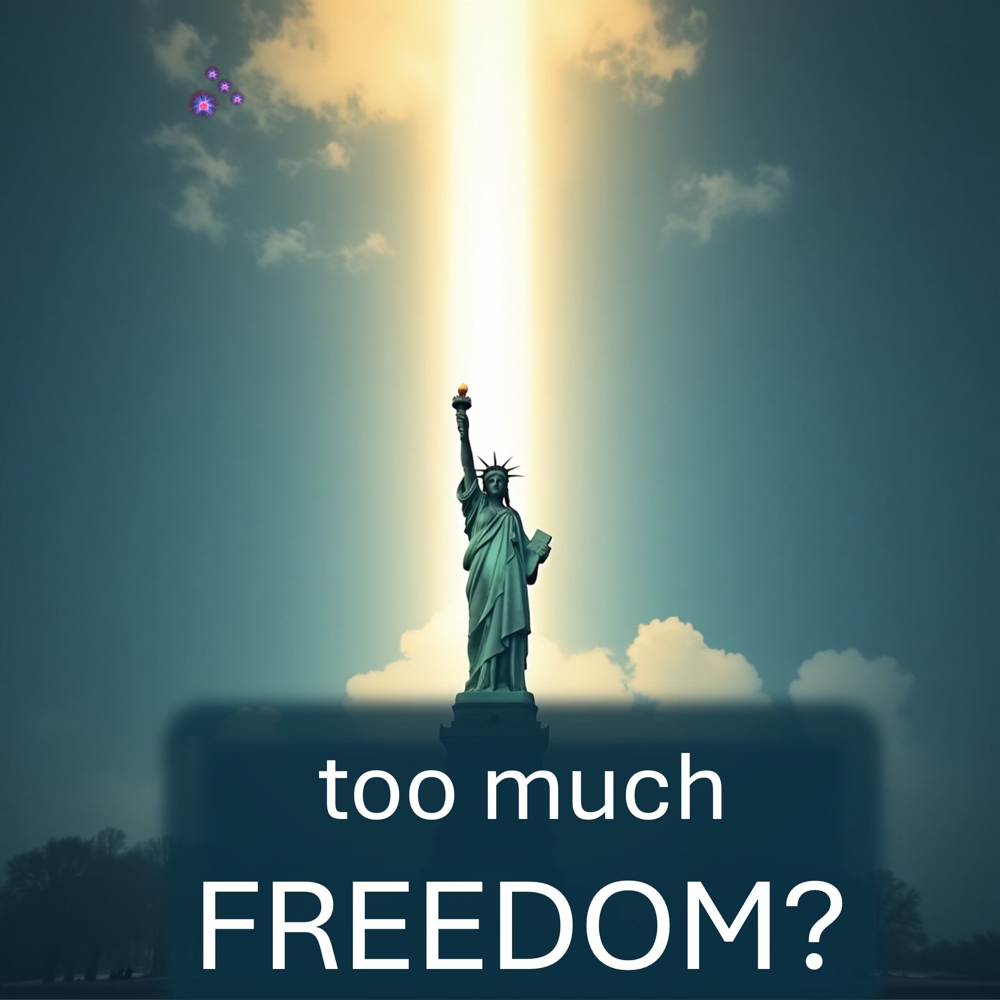

هل يمكن أن يكون هناك الكثير من الحرية؟

سوف تفاجأ - لذا التمسك بمعرفة ذلك.

وفقًا لمؤشر حرية الإنسان ،

المكان الأكثر حرية على الأرض هو سويسرا.

أيضًا ، ترتبط الحرية بتحسين الرضا والإنتاجية.

هممم.

هل يمكن أن يكون هناك الكثير من الحرية؟

أعني ، إذا ارتكبت جريمة في سويسرا ، فسوف ينتهي بك الأمر في السجن.

في الواقع ، هناك مكان أكثر حرية من سويسرا.

الجحيم هو المكان الوحيد الذي يمكنك فيه الابتعاد عن أي شيء.

سيكون الجحيم ميزة لأقوى شخص في الجحيم.

لن تكون أنت.

فقط مواطني السماء لن ينتهي في الجحيم.

يمكن لأي شخص أن يصبح مواطنًا للسماء اليوم ، من خلال الإيمان والخضوع ليسوع.

ذهب يسوع إلى الجحيم حتى لا تضطر إلى ذلك.

فتح يسوع السماء أيضًا لأولئك الذين يوافقون على حب الآخرين.

اقبل عرض يسوع الآن بقول الصلاة في الوصف.

هذا هو القرار الأكثر أهمية في حياتك.

كن مواطنًا للسماء بقوله هذا لله ويعنيه

عزيزتي المبدع من السماء والأرض ، أعتقد أن يسوع المسيح هو كلمتك ، الذي أصبح جسديًا. أعتقد أن يسوع عاش بدون خطيئة ، مات على الصليب لدفع ثمن خطاياي ، وهزمت الموت وأحيا. أعتقد أنه بعد تحقيق كل هذه ، قدم يسوع لي نوعًا من حياتك ، لتحريرني من الموت. أنا أقبل حياتك. شكرا لك يا أبي. أخضع بكل سرور لتأثيرك من خلال المسيح اليوم وإلى الأبد. كل هذا ، أعلن باسم يسوع.

آية الكتاب المقدس

بالنسبة لمجنسيتنا في السماء ، والتي ننتظر منها بشغف المنقذ ، الرب يسوع المسيح. -Philippians 3:20 (LSB)

المراجع

https://www.fraserinstitute.org/studies/human-freedom-index-2024

~~

https://liveabove3d.com/en/welse/

youtube: www.youtube.com/@live.above.3d

tiktok: www.tiktok.com/@live.above.3d

x: www.x.com/live_above_3d

reddit: www.reddit.com/user/live-above-3d-3d

instagram www.instagram.com/live.above.3d

Facebook: www.facebook.com/profile/10009239087423

