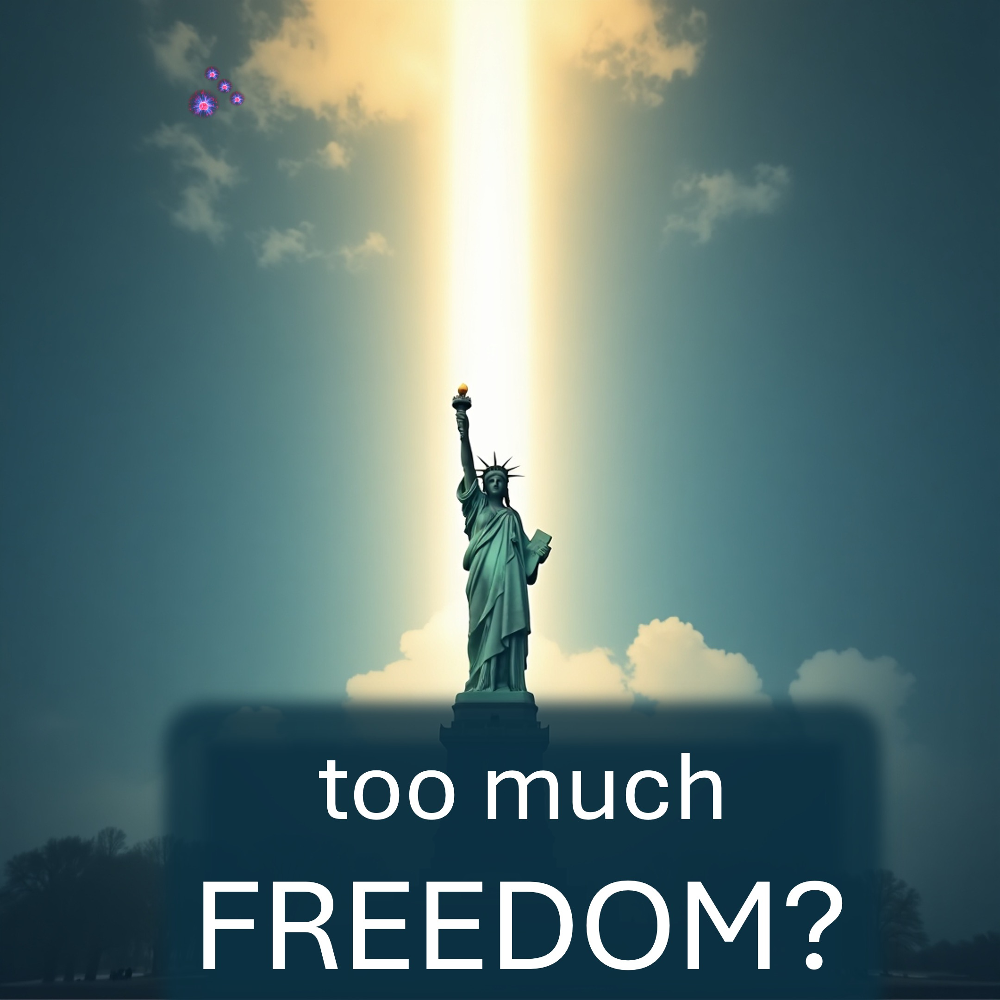

Чи може бути занадто багато свободи?

Ви будете здивовані - тому тримайтеся, щоб дізнатися.

За індексом свободи людини,

Вільне місце на Землі - Швейцарія.

Також свобода пов'язана з поліпшеним задоволенням та продуктивністю.

Хммм.

Чи може бути занадто багато свободи?

я маю на увазі, якщо ви вчините злочин у Швейцарії, ви опинитесь у в'язниці.

Дійсно, десь вільніше, ніж Швейцарія.

Чорт - це єдине місце, де ви можете піти з чим завгодно.

пекло буде перевагою для найсильнішої людини в пеклі.

це не буде ти.

Тільки громадяни неба не опиняться в пеклі.

Будь -хто може стати громадянином Неба сьогодні, вірячи і підкоряючись Ісусу.

Ісус пішов до пекла, щоб не потрібно було.

Ісус також відкрив небо для тих, хто погоджується любити інших.

Прийміть пропозицію Ісуса зараз, сказавши молитву в описі.

Це єдине найважливіше рішення вашого життя.

Стати громадянином Неба, кажучи це Богові і маючи на увазі це

Шановний Творець Небесного і Землі, я вважаю, що Ісус Христос - це ваше слово, яке стало плоттю. Я вважаю, що Ісус жив без гріха, загинув на хресті, щоб заплатити за всі мої гріхи, перемогли смерть і воскрес. Я вважаю, що після досягнення всього цього Ісус запропонував мені ваше життя, звільнити мене від смерті. Я приймаю ваше життя. Дякую, отче. Я із задоволенням підкоряюся вашому впливу через Христа сьогодні і назавжди більше. Все це, я заявляю в ім’я Ісуса.

Біблійний вірш

Бо наше громадянство знаходиться на небі, з якого також ми з нетерпінням чекаємо Спасителя, Господа Ісуса Христа. -Philiippians 3:20 (LSB)

ДОВІДКИ

https://www.fraserinstitute.org/studies/human-freedom-index-2024

рекомендовано

https://leiveabove3d.com/en/welcome/ ~~ ~ www.youtube.com/@live.above.3d

tiktok: www.tiktok.com/@@live.above.3d

x: www.x.com/Live_above_3d

reddit: www.reddit.com/user/live-3d-3d ~~ ~ instagram: wwwwwwwww.instagr

Facebook: www.facebook.com/profile/100092339087423

