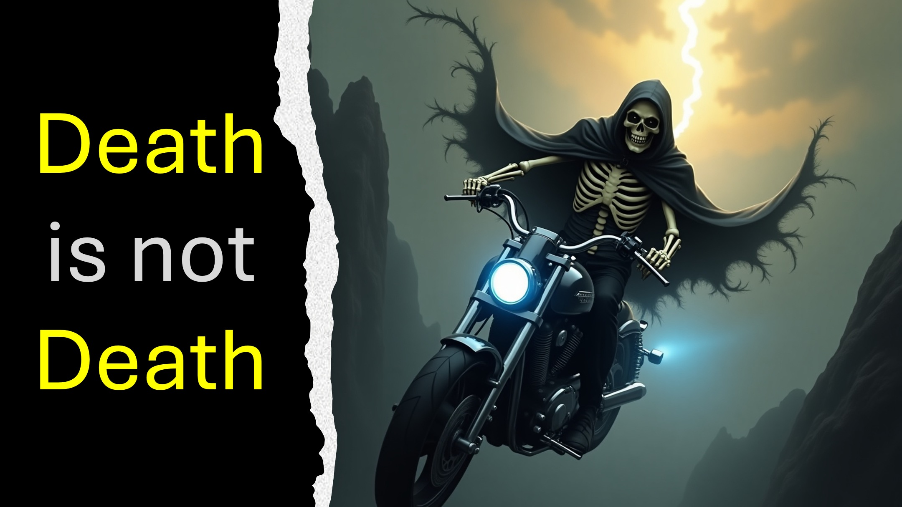

الموت ليس الموت ~~ ~ يقول الكتاب المقدس أن أي شخص يؤمن بيسوع لا يموت.

ومع ذلك نعلم أن المسيحيين كانوا يموتون كل هذا الوقت.

حسنًا ، يوضح الكتاب المقدس أن موت الجسد ليس هو الوفاة التي يجب أن نهتم بها.

هناك وفاة أخرى بعد ذلك ، والتي لا توجد عودة منها.

هذا هو الموت أولئك الذين يؤمنون بيسوع لن يتذوق أبدًا.

هناك المزيد.

الحياة ليست الحياة.

يتحدث إلى البشر الأحياء ، قال يسوع:

"لقد جئت حتى تتمتع بالحياة".

ومع ذلك نعلم أن هؤلاء يسوع كان يتحدث إليهم كانوا على قيد الحياة.

حسنًا ، يوضح الكتاب المقدس أن حياة الجسم ليست هي الحياة التي يجب أن نهتم بها.

هناك حياة أخرى أكبر من ذلك ، والتي لا يلوم عليها ، لا شيخوخة ، لا انخفاض.

هذه هي الحياة التي تلقها أولئك الذين يؤمنون بيسوع بالفعل.

لديك بالفعل حياة الرب.

آيات الكتاب المقدس

يأتي اللص فقط لسرقة وقتل وتدمير ؛ جئت أنهم قد يكونون حياة ، ويحصلون عليها بكثرة. - يوحنا 10:10.

كل من يعيش ويؤمن بي لن يموت أبدًا - على الإطلاق. هل تصدق هذا؟ - يوحنا 11:26.

الموصى بها

https://liveabove3d.com/en/welcome/

تعرف على المزيد

الموقع الإلكتروني: www.liveabove3d.com

youtube: www.youtube.com/@live.3d www.x.com/live_above_3d

reddit: www.reddit.com/user/live-above-3d

instagram: www.instagram.com/live.above.3d

facebook: www.facebook.com/profile/1000923390874233

