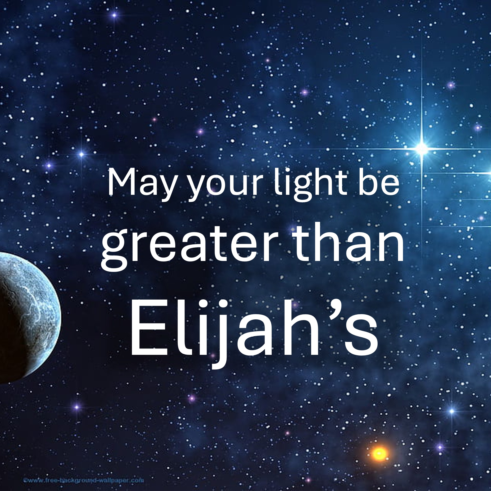

আমি আজ আপনার কাছে ভবিষ্যদ্বাণী করছি।

যে আপনার উদ্ঘাটন নবী এলিয়ের চেয়ে বড়। এলিয়ের প্রকাশের জন্য সত্যই দুর্দান্ত ছিল।

এতে, তিনি কেবল একটি ছোট মেঘ তৈরি দেখে জানতেন যে প্রচুর বৃষ্টিপাত রয়েছে।

যদিও বছরের পর বছর ধরে বৃষ্টি পড়েনি।

আমি ঘোষণা করি।

আপনাকে শক্তিশালী বাতাস দেখার দরকার নেই।

আপনার বজ্র এবং বজ্রপাত বা গা dark ় মেঘ দেখার দরকার নেই।

আপনার সমস্ত কিছু জানতে হবে যে সদাপ্রভু সরে গেছেন,

তাঁর শব্দের প্রবেশদ্বার। Jesus যিশুর নামে - আমেন।

#লাইট #রিভেলেশন #এলিজাহ #ফাইথ #রেইন

প্রস্তাবিত

https://liveabovove3d.com/en/welcome/

বাইবেল শ্লোক

ইলিয়াস আমাদের মতো আবেগের সাপেক্ষে এমন একজন ব্যক্তি ছিলেন এবং তিনি পৃথিবী দ্বারা প্রার্থনা করেছিলেন এবং এটি পৃথিবী দ্বারা উপশম হয় না এবং এটি স্থান নাও উপস্থাপিত হয় না। - জেমস 5:17

আরও জানুন

ওয়েবসাইট: www.liveabove3d.com www.reddit.com/user/live-above-3d

ইনস্টাগ্রাম: www.instagram.com/live.above.3d

