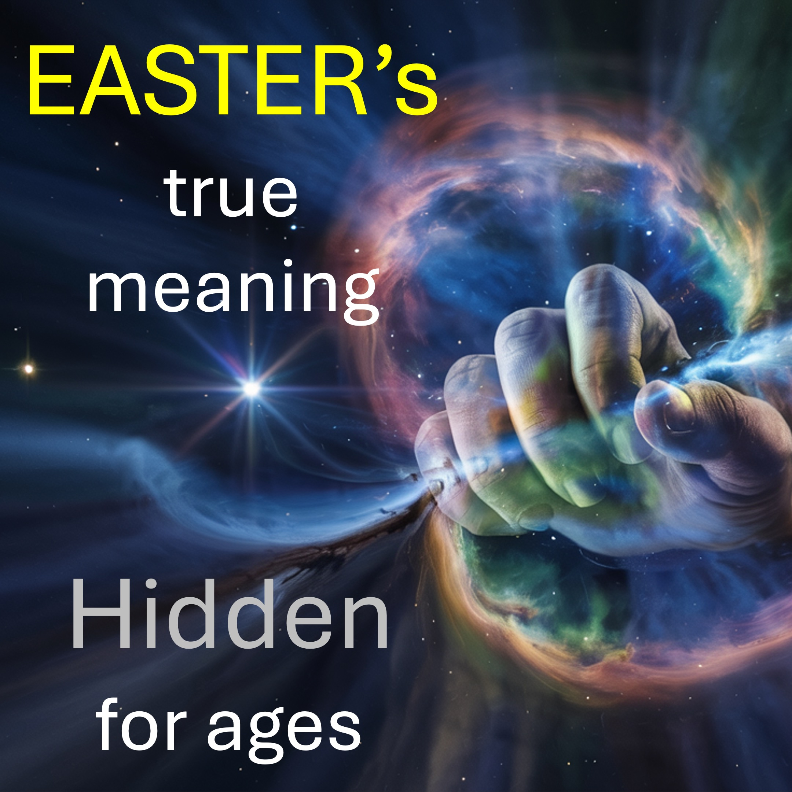

We will learn the main thing you need to know – to overcome evil.

Hmmm.

Preachers often preach that your alter (and its sacrifice) must be greater than that of the enemy.

Fortunately, you already have the greatest alter,

on which the greatest sacrifice was made. 

Yahweh Adonai (creator of all things visible and invisible) was sacrificed for your sake.

What more do you need?

No wonder Jesus said:

“I give you power, over all the power, of the enemy”.

Did you not accept that power?

How do we know you have that power, if you don’t use it?

How do we know you have that power, if you spend much time worrying or praying for yourself?

Do this instead.

See the future you want.

Continue to declare the future you want.

Use your power to save others.

Remember.

You have power, over all the power of the enemy.

Have a powerful Easter.

#overcome #alter #sacrifice #YHWH #Jesus #power #pray

RECOMMENDED

https://liveabove3d.com/en/welcome/

BIBLE VERSE

Behold, I give unto you power to tread on serpents and scorpions, and over all the power of the enemy: and nothing shall by any means hurt you. - Luke 10:19

LEARN MORE

Website: www.liveabove3d.com

YouTube: www.youtube.com/@live.above.3d

TikTok: www.tiktok.com/@live.above.3d

X: www.x.com/live_above_3d

Reddit: www.reddit.com/user/live-above-3d

Instagram: www.instagram.com/live.above.3d

Facebook: www.facebook.com/profile/100092339087423

PROMPT TO GENERATE COVER IMAGE

Star forming gas in space. the gas is in the shape of a hand holding a knife. the gas should be striking. the space behind should striking with a few bright stars. the stars should be distant but bright.

https://ideogram.ai/g/C9cqgINiSwiufSMrzIFspQ/3