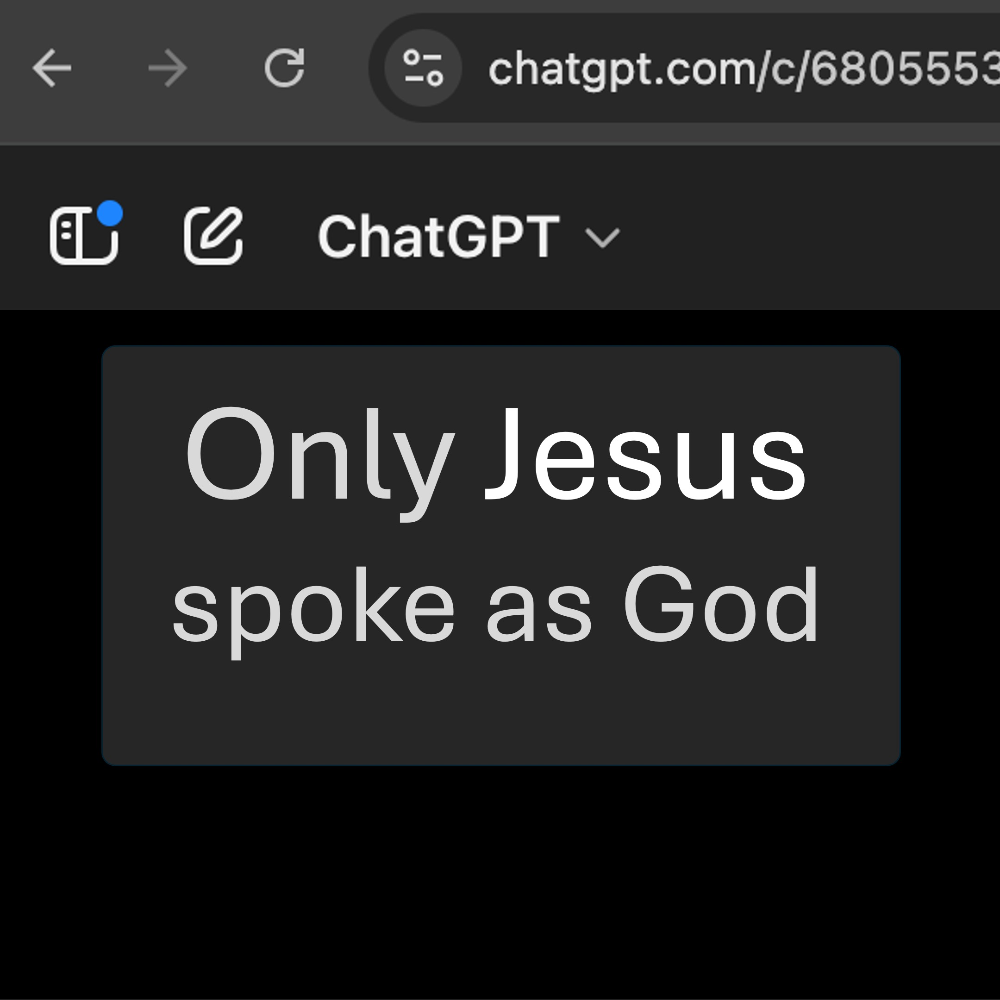

سؤال إلى chatgpt

هل هناك في أي مكان في الكتاب المقدس حيث تحدث الشخص كه؟ هذا بصرف النظر عن يسوع المسيح. لتوضيح ، شخص يتحدث عن الله ، يقول شيئًا مثل: "هكذا يقول الرب ، لقد أعطيتك النصر". من ناحية أخرى ، سيقول شخص يتحدث باسم الله: "لقد أعطيتك النصر". من المهم أيضًا التمييز بين كتابة ما كشفه الله والتحدث باسم الله. عند كتابة ما كشفه الله ، لن تكون هناك حاجة لقول: "هكذا يقول الرب". لذلك نستبعد هذا من طلبنا. نحن مهتمون بأماكن في الكتاب المقدس حيث تحدث الإنسان الذي يتحدث مباشرة إلى الآخرين كله ، باستثناء يسوع. إذا كانت هناك أماكن تحدث فيها الإنسان كه ، فيرجى إدراج 3 مثيلات مع آيات الكتاب المقدس المناسبة للرجوع إليها. إذا لم يكن هناك مثل هذا المكان ، فمن المهم أن نقول أنه لا يوجد مكان من هذا القبيل في الكتاب المقدس ، لأن ذلك سيكون الإجابة الصحيحة.

إجابة chatgpt

https://chatgpt.com/share/680ca1e0-8ea8-800f-937f-678b2b8d768a

ما تستبعده:

* يسوع المسيح-أنت لا تسأل عنه.

* الكتابة كه في الكتاب المقدس - مثل عندما يكتب موسى كلمات الله في الشخص الأول (على سبيل المثال ، سفر التثنية) ، لكنه جزء من الوحي المكتوب ، وليس الكلام.

* أنبياء يقولون "هكذا يقول الرب" - أنت تبحث عن الكلام بدون هذه المقدمة.

ما تبحث عنه:

* يتحدث الإنسان بصوت عالٍ للآخرين

* يتحدث في الشخص الأول كما لو كانوا الله

* لا توجد عبارة تمهيدية مثل "هكذا يقول الرب"

الإجابة النهائية

لا توجد أماكن في الكتاب المقدس حيث يتحدث الإنسان إلى الآخرين (في الشخص الأول) ، دون تحديد هذه الكلمات من الله. كل الأنبياء الحقيقيين يميزون أنفسهم كرسلون ، وليس الله نفسه.

ملاحظات إضافية:

* أنبياء مثل موسى ، أشعيا ، إرميا ، وما إلى ذلك ، غالباً ما تحدثوا من أجل الله ، لكنهم سيوضحون دائمًا أنهم يتحدثون نيابة عن الله ، وليس الله نفسه.

* في سفر التثنية 5: 24-27 ، يطلب الناس في الواقع موسى عدم وجود الله يتحدث إليهم مباشرة ، ولكن ليكون وسيطًا. ومع ذلك ، ينقل موسى ما يقوله الله ، ولا يتحدث أبداً كه.

* الأنبياء الكذبة في الكتاب المقدس يتظاهرون أحيانًا بالتحدث عن الله ، لكن هذا مدان ولم يؤيده أبدًا (انظر إرميا 23:16 ، حزقيال 13: 6).

الموصى بها

https://liveabove3d.com/en/welcome/

تعرف على المزيد

الموقع الإلكتروني: www.liveabove3d.com

youtube: www.youtube.com/@live.3d www.x.com/live_above_3d

reddit: www.reddit.com/user/live-above-3d

instagram: www.instagram.com/live.above.3d

facebook: www.facebook.com/profile/1000923390874233

