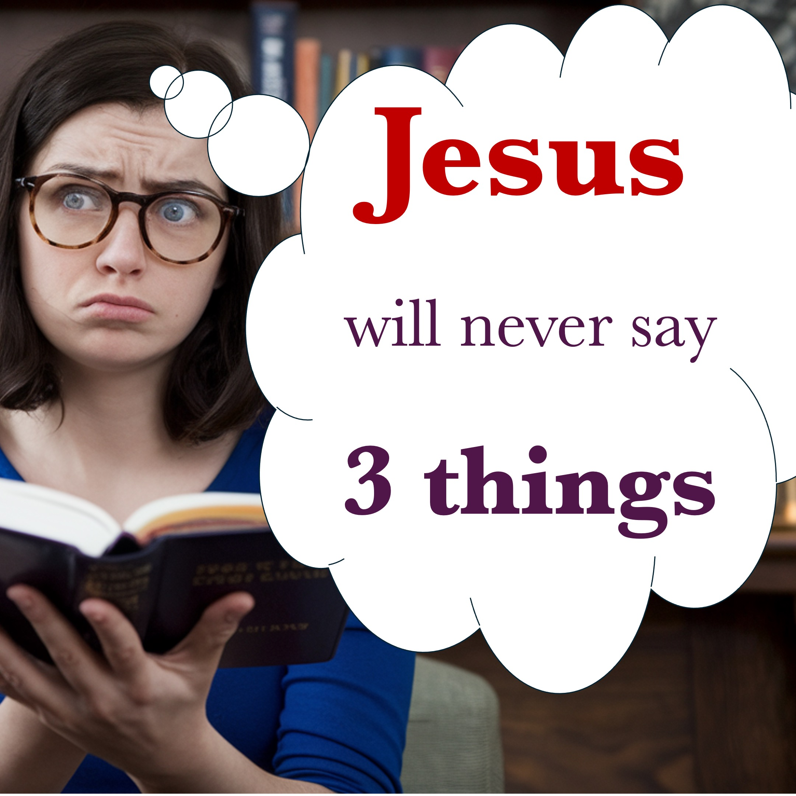

Ecco 3 cose che Gesù non dirà mai.

Tre modi in cui non dovremmo mai parlare.

Uno - Paura.

Gesù non dirà mai "fai attenzione"; o "Temo che non ascolteranno".

Due - incertezza.

Gesù non dirà mai "Non lo so". Ad esempio, "Non so perché tu lo faccia a fidarti di me".

TRE - APOGIA.

Gesù non scuserà mai. Ad esempio, "Mi dispiace per essere arrivato in ritardo".

Di questi tre (paura, incertezza e scuse) solo uno è "non" un peccato.

Indovina quale?

Facci sapere nella sezione commenti.

#Jesus #Christ #Faith #Fear #Boldness #Uncerty #apology #sin #Trust

Versi della Bibbia

Per tutti noi in molti modi. Se qualcuno non si imbatte in ciò che dice, è un uomo perfetto, in grado di bloccare anche tutto il corpo. - Giacomo 3: 2

Ma ti dico che ogni parola negligente che parla, darà una contabilità nel giorno del giudizio. – Matthew 12;36

RECOMMENDED

https://liveabove3d.com/en/welcome/

LEARN MORE

Website: www.liveabove3d.com

YouTube: www.youtube.com/@live.above.3d

TikTok: www.tiktok.com/@live.above.3d

X: www.x.com/live_above_3d

reddit: www.reddit.com/user/live-above-3d

Instagram: www.instagram.com/live.above.3d

Facebook: www.facebook.com/profile/100092339087423