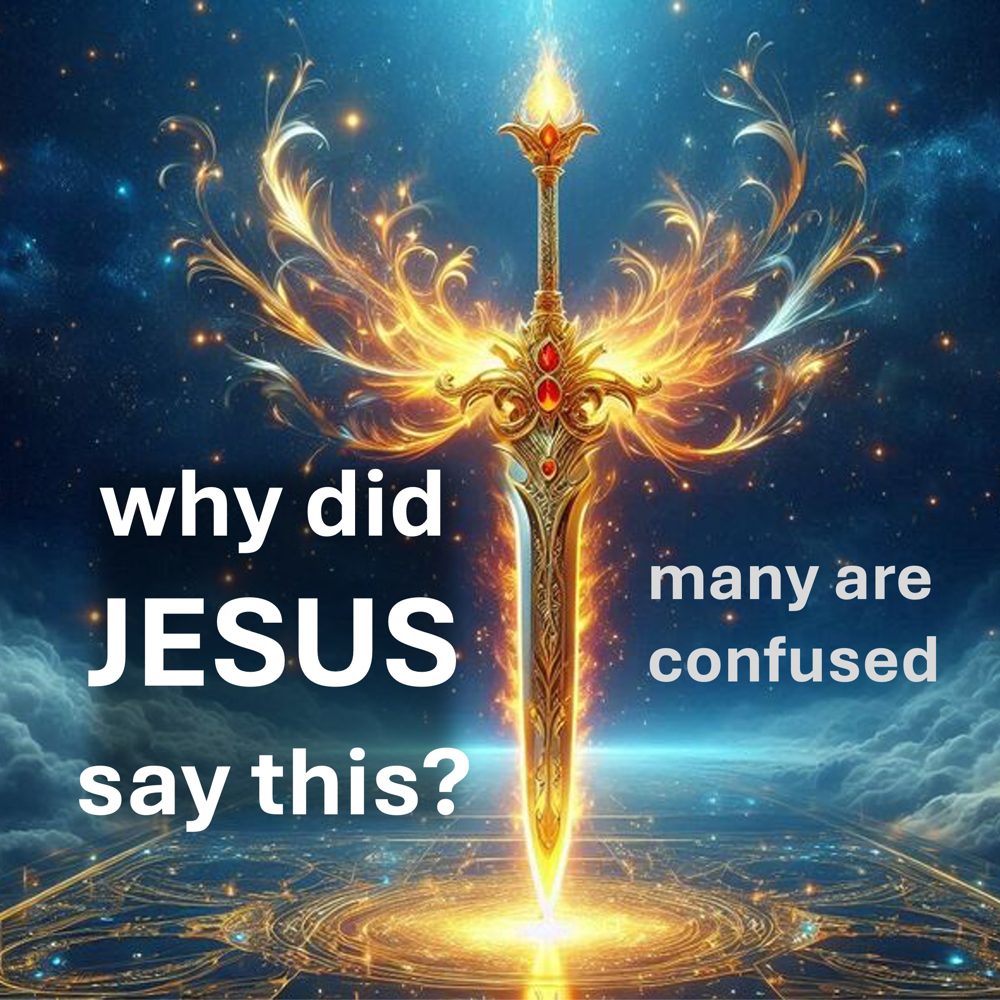

¡Fe! ¿Por qué tan duro?

Vamos a descubrirlo.

Al final, hay algo especial que alentarte; No te lo pierdas.

Digamos que rezan a Yahweh por un nuevo trabajo.

uno - La fe será probada.

Es enero y su amigo pregunta si planea viajar en verano.

Dices que no, porque con tu trabajo actual, no puedes pagar las vacaciones.

Así, fallaste la prueba, porque no crees que tendrás un nuevo trabajo para el verano.

Dos: ya tienes fe

Entonces, sepa que incluso si fallas en una prueba, tienes suficiente fe, para hacer crecer tu fe, hasta que pases la prueba, la próxima vez.

Tres: se lo analizará tantas veces como use su fe.

Entonces, anímate, diga algo y manténgalo, luego serás probado.

Parte 3 de esta revelación sale el viernes, así que síganos para recibir.

#Christiantok

verso bíblico

Que el juicio de su fe, que es mucho más precioso que el oro que perece, aunque se intente con fuego, podría encontrarse a la alabanza y honor y gloria ante el aparición de Jesucristo: - 1 Pedro 1: 7

por la gracia que me dio a mí digo a cada uno de los que no piensan que no piense más de lo que es más importante que pensar; Pero pensar para tener un pensamiento sólido, como Dios ha asignado a cada una medida de fe. -Romanos 12: 3

Recomendado

https://liveBove3d.com/en/welcome/
https://liveBove3d.com/2025/05/02/en/strange-case-of-the-missing-ring/

Aprendizaje más

Sitio web: wwww.liveabeve3d.com

www.youtube.com/@live.above.3d

tiktok: www.tiktok.com/@live.above.3d

x: www.x.com/live_above_3d

reddit: www.reddit.com/User/live-above-3d

instagram: www.instagramam.com..com..Con.

Facebook: www.facebook.com/profile/100092339087423