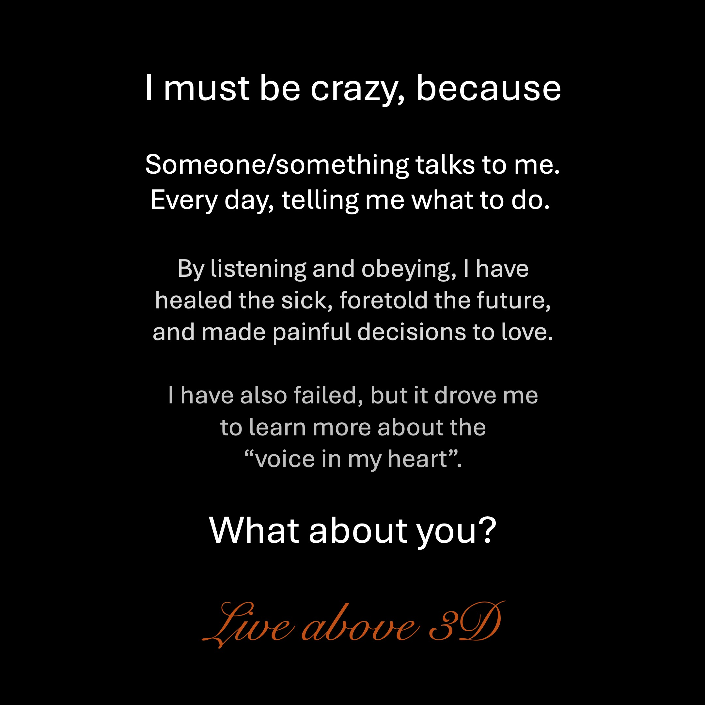

누군가/무언가가 나에게 말하기 때문에 나는 미쳤어 야한다.
매일, 무엇을 해야하는지 말해주십시오.
듣고 순종함으로써, 나는

아픈 사람들을 치유하고 미래를 예언하고
사랑에 대한 고통스러운 결정을 내 렸습니다.
나도 실패했지만

“내 마음 속의 목소리”에 대해 더 많이 배우기 위해 나를 몰아 냈습니다.
당신은 어떻습니까?
음악

https://music.youtube.com/channel/ucuhizxvdlucf3huviyc0qzw

https://music.youtube.com/watch?v=fgg9x-v6pq

-왜 그렇게 힘든 이유는 무엇입니까?

1 부 - https://youtube.com/shorts/b8jogaatmei (48 초)

2 부 - https://youtube.com/shorts/rdoyifazicc (47 초)

파트 3 -https://youtube.com/shorts/kzvzvzvzvzvzvzvzvzvzvzvzvzvzvzvzvzvzvzvzvzvzvzvzvzvzvzvzvzvzvzvzvzvzvzvzvzvzvzvzvzvzvzvzvzvzvzvzvzvzvzvzvzvzvzvzv _nc (54 seconds/- ~ - 웹 사이트 : https://liveabove3d.com/en/welcome/

youtube : www.youtube.com/@live.above.3d

tiktok : www.tiktok.com/@live.above.3d

x : www.x.com/live_above_3d ~~ reddit : www.reddit.com/user/live-above-3d

Instagram : www.instagram.com/live.above.3d

Facebook : www.facebook.com/profile/100092339087423

