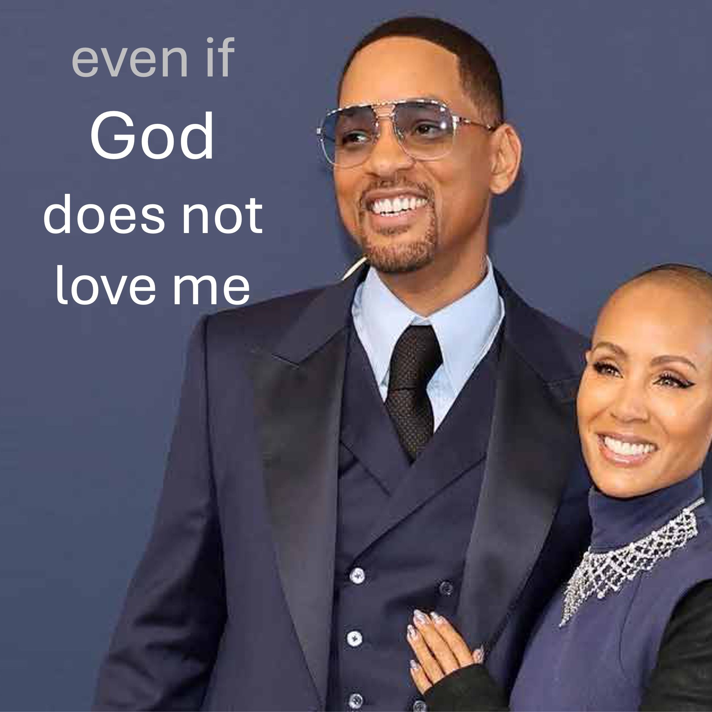

এমনকি God শ্বর যদি তিনি আমাকে যেভাবে দেখিয়েছেন (এবং দেখানো) আমাকে ভালবাসেন না তবে আমি এখনও একজন খ্রিস্টান হব।

আমি বিশ্বাস করি যে আমরা যিনি সমস্ত কিছু জানেন তার মনের বিচার করতে আমরা খুব কম জানি।

আমি আরও বিশ্বাস করি যে যে কেউ আপনাকে তৈরি করে সে আপনার উপর অধিকার রাখে। You আপনি যদি না বলেন, তবে আমি আপনাকে এটি জিজ্ঞাসা করি:

কল্পনা করুন যে আপনি একটি বাড়ি তৈরি করেছেন।

35 বছর ধরে কোনও সংস্থায় কাজ করার পরে বাড়িটি আপনার প্রচেষ্টার গৌরব।

আপনি যখন আপনার বাড়িতে চলে যাচ্ছেন, তখন আপনার বাড়িটি জীবিত হয়ে উঠেছে এবং বলে:

"আপনি কী জানেন, আমি বরং একটি প্রত্যাখ্যান ডাম্প হতে চাই"

কীভাবে আমরা আমাদের শহরের কেন্দ্রস্থলে অবস্থিত, আমাদের শ্বাস-প্রশ্বাস গ্রহণকারী লুভের যাদুঘরটিকে প্রত্যাখ্যান ডাম্পে পরিণত করতে পারি?

আপনি কি করবেন?

আমি গ্যারান্টি দিচ্ছি যে আপনি সেই বাড়িটি ভালবাসার সাথে শৃঙ্খলাবদ্ধ করবেন।

এটি হ'ল, যদি না আপনি আপনার সন্তানের কিছু করতে এবং উইল এবং জাদা পিঙ্কেট স্মিথের মতো কিছু না করতে ইচ্ছুক না হন।

আপনি কি মনে করেন?

#god #love #খ্রিস্টান #ডিসিসিপ্লাইন #উইলস্মিথ #জাদাপিঙ্কেটস্টিমিথ

বাইবেল শ্লোক

যদি আমরা আমাদের God শ্বরকে পরিবেশন করি তবে আমরা আমাদেরকে জ্বলন্ত আগুনের চুল্লি থেকে উদ্ধার করতে সক্ষম হন, হে রাজা, তিনি আমাদের উদ্ধার করুন। তবে যদি তা না হয় তবে হে রাজা, এটি আপনার কাছে পরিচিত হোন যে আমরা আপনার দেবতাদের সেবা করব না এবং আপনি যে সোনার মূর্তিটি স্থাপন করেছেন তা আমরা উপাসনা করব না। - ড্যানিয়েল 3: 17-18

প্রস্তাবিত

বিশ্বাস - এত কঠিন কেন?

পার্ট 1 - https://youtube.com/shorts/b8jogaatmei (48 সেকেন্ড)

পার্ট 2 - https://youtube.com/shorts/rdoyifazicc (47 সেকেন্ডস)

পার্ট 3 - এইচটিপিএস:/yuoutube.com/short ওয়েবসাইট: www.liveabove3d.com/en/welcom/

ইউটিউব: www.youtube.com/@live.above.3d www.reddit.com/user/live-above-3d

ইনস্টাগ্রাম: www.instagram.com/live.above.3d

