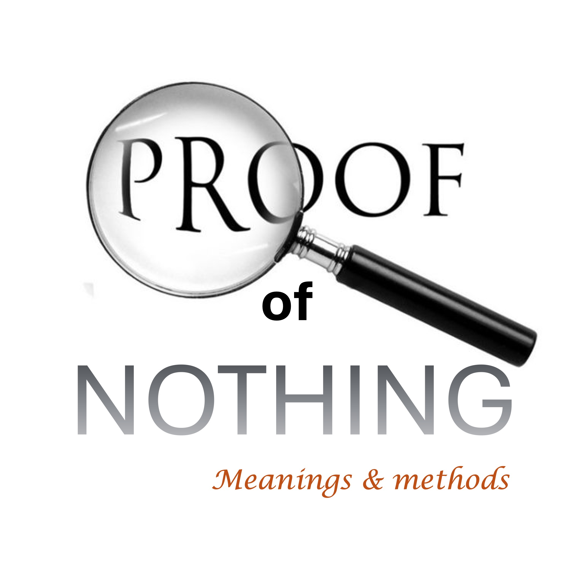

顶级癌症专家宣布您的妻子会。

在信仰上，您宣称她将活着荣耀上帝。

信仰是证据。

您知道只有在真相时才要求证据。

没有人需要证据证明1加1是2，在法庭上。

在您的情况下，有99.9％的时间要求证据

当高级专家说您要去 - 您会的。

如果您有足够的祝福，可以找到您妻子将活的证据，请

去法庭并提出案子。

这是一个精神上的法庭，因此请在证据上繁殖。

一个人会被看到一个人竞争 - 与主题交谈。

在每一转弯都重复证据以抵抗死亡的想法。

这是重要的部分。

育成的unil，您开始下意识地脱颖而出。

从心中发自内心的话就像狮子的咆哮。

无论你吼什么；一定会过去。

#death #faith＃vercente #court #brood＃roar＃joshua1：8＃james5：16

圣经经文

现在信仰现在是希望的东西的实质，是事物而不是湖泊的证据。 - 希伯来书11：1。谁治愈了所有疾病； - 诗篇105：2-3。

你们中间有生病吗？让他呼吁教会的长老；让他们为他祈祷，用主的名义涂油：信仰的祈祷将拯救病人，主应抚养他。如果他犯了罪，他们将原谅他。 -James 5：14-15

谁拥有自我在树上的身体中裸露我们的罪过，我们死于罪恶，应该活到正确的罪恶：由他们的条纹康复。 -1彼得2:24。
义人的心脏要回答：但是，邪恶的嘴倾倒了邪恶的事物。 - 谚语15:28。

这本法律本书不会离开你的嘴。但是，您日夜都要沉思热素，您可能会根据所有写的热量观察到的事情：因为那时你会让你的路繁荣，然后你就取得了良好的成功。 -Joshua 1：8

承认您的错彼此，为彼此祈祷，可以治愈您。一个义人的有效的狂热祈祷利用了很多。 - 詹姆斯5:16

信徒的强烈，热情，深刻和真诚的祈祷使大量的权力可用。 - 詹姆斯5：16b释义。
