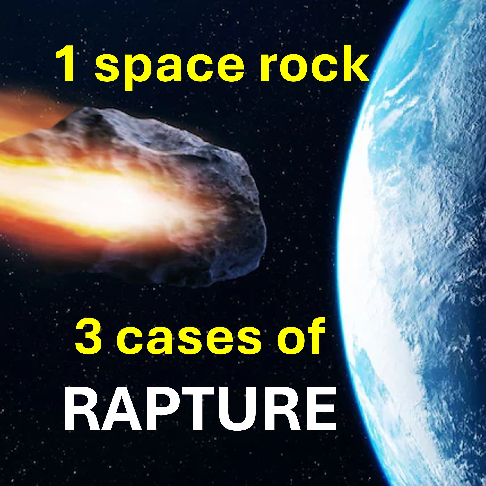

Before we start, know that 2025 is a turning point.

Hmmn.

Apophis is an, that was predicted to have a chance of hitting earth in 2029, 2036, and 2068.

2029.

The rapture will happen in September 2025, when Israel would be 77 years old.

In which case, the space rock Apophis will crash into earth in 2029, during the tribulation.

2036

We get a 7-year grace, and the rapture happens in September 2032

In which case, Apophis will crash into earth when it comes back in 2036.

2068

We get a 40-year testing, and the rapture happens in September 2065

In which case, Apophis will crash into earth when it comes back in 2068.

Let us spread the gospel with increased passion and unite to welcome our groom.

Lest we fall into a 40-year testing.

#apophis #2025rapture #2029rapture #2036rapture #2068rapture

LEARN MORE

Website: www.liveabove3d.com/en/welcome/

YouTube: www.youtube.com/@live.above.3d

TikTok: www.tiktok.com/@live.above.3d

X: www.x.com/live_above_3d

Reddit: www.reddit.com/user/live-above-3d

Instagram: www.instagram.com/live.above.3d

Facebook: www.facebook.com/profile/100092339087423
423
