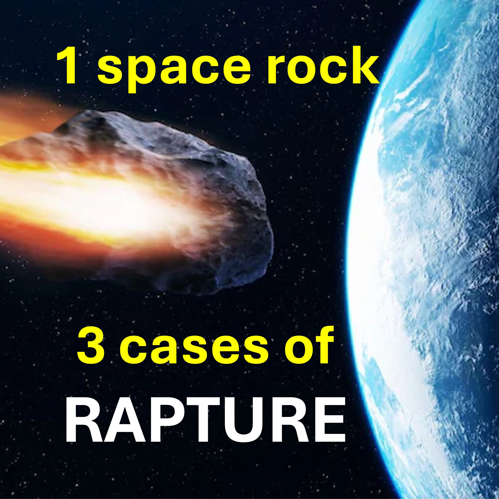

Antes de comenzar, sepa que 2025 es un punto de inflexión.

Hmmn.

apophis es un, que se predijo que tendrá la oportunidad de golpear la Tierra en 2029, 2036 y 2068.

2029.

El rapto quiere suceder en septiembre de 2025, cuando Israel tendría 77 años.

En cuyo caso, la apophis de la roca espacial quiere accidentes a la Tierra en 2029, durante la tribulación.

2036

Obtenemos una gracia de 7 años, y el Rapto ocurre en septiembre de 2032

En cuyo caso, Apophis quiere un choque en Tarth cuando regrese en 2036. El caso, Apophis quiere un choque en la Tierra cuando regrese en 2068.

para que no caigamos en una prueba de 40 años.

#apophis #2029Rapture #2036Rapture #2068Rapture

Aprenda más

Sitio web: www.liveBoveve3d.com/en/welecome/

YouTube: www.youtube.com/@live.above

tiktok: wwww.tiktok.com/@live.above.3d

x www.x.com/live_above_3d

Reddit: www.reddit.com/user/live-above-3d

Instagram: www.instagram.com/live.above

Facebook: www.facebook.com/profile/100092339087423

