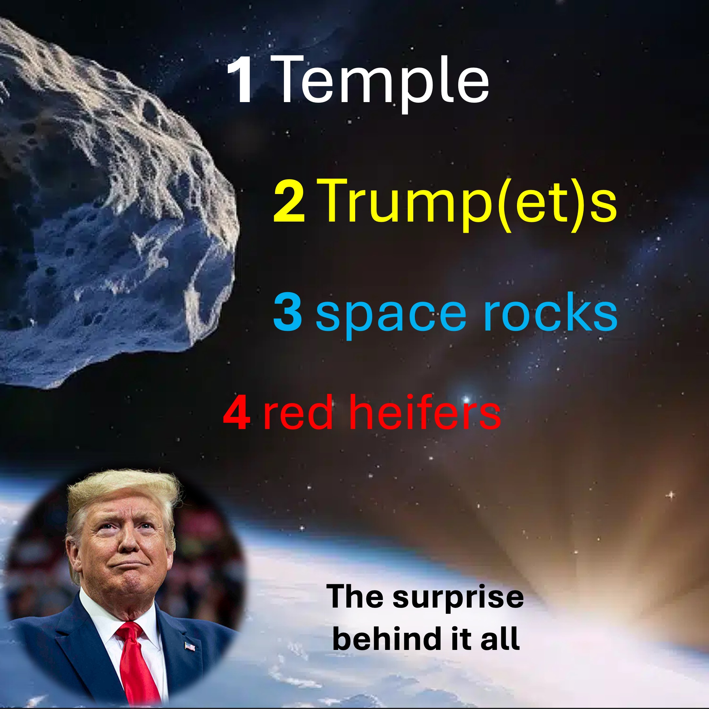

From the time of Moses until the destruction of the Second Temple in 70AD,

there have been nine red heifers used for purification rituals. 

According to Jewish tradition, the tenth red heifer is a sign of the coming of the Messiah and the rebuilding of the Temple. 

---

“And the strong leader will make a 7-year agreement with many, but in the middle of the 7 years, he will break the agreement and stop the Jews from offering sacrifices” - Daniel 9 verse 27.

---

In September 2022, five red heifers were imported from Texas, USA, to Israel. 

A red heifer is ready for sacrifice between the ages of three and four. 

By September 2025, the red heifers will be around 4 years old.

If the rapture doesn’t happen by that time, then – you do the math.

What has red heifers got to do with Donald Trump and space rocks?

Well, in 2017, about eight months after Donald Trump became president,

a strange space rock, named Oumuamua flew past earth.

Oumuamua is the first space rock from outside our solar system.

Also, its shape and speed were unlike other space rocks.

Guess what - in September 2025, about eight months after Donald Trump became the president for the second time,

a second strange space rock, named Borisov, will fly past earth.

This second space rock may have a role to play after the rapture.

We’ll reveal this at the end, and It’ll shock you – so stay till the end.

It is one thing for space rocks to fly past, but when they come crashing into the earth – chaos and disorder.

And just like that, a large space rock named Apophis (or chaos and disorder), was discovered (in 2004) to be heading towards earth. 

---

“And the second angel sounded his trumpet, and something like a great mountain burning with fire was thrown into the sea; and a third of the sea became blood” - Revelation 8 verse 8.

---

Scientists first said Apophis had a chance of hitting the earth but later changed their words.

If a space rock could hit the earth and cause serious damage,

the responsible thing may be to not cause panic - by hiding the truth.

Just like that, in the movie “Don’t look up”, the government downplayed the fact that a comet was going to crash into earth.

If the rapture happens on the feast of trumpets in September 2025, religious, political, economic and social influencers will all say that:

“The space rock Borisov is an alien ship which has snatched up a large number of humans”.

Also - “One good reason why it cannot be the rapture predicted by the Bible is that many non-Christians were also taken”.

Fact-check - many Christians will not be raptured, and many non-Christians (who secretly believe Jesus) will be raptured.

All this will give some, good reason to unify the earth under - one strong leader.

Need I say more?

REFERENCES

Jewish TEMPLE INSTITUTE: https://templeinstitute.org/red-heifer-the-tenth-red-heifer/

NASA: https://science.nasa.gov/solar-system/comets/oumuamua/

NASA: https://science.nasa.gov/solar-system/comets/2i-borisov/

FOLLOW or SUBSCRIBE to LiveAbove3D

Website: www.liveabove3d.com/en/welcome/

YouTube: www.youtube.com/@live.above.3d

TikTok: www.tiktok.com/@live.above.3d

X: www.x.com/live_above_3d

Reddit: www.reddit.com/user/live-above-3d

Instagram: www.instagram.com/live.above.3d

Facebook: www.facebook.com/profile/100092339087423

ABOUT LiveAbove3D

We spread extra dimensional consciousness. The realm of the spirit (or fourth dimension) is right here, right now, all around us.

We are living witnesses/evidence of Yahweh Adonai and his express image: Jesus Christ. Our message (witness/evidence) is primarily for non-Christians.

#LiveAbove3D #samshamoun #dailydoseofwisdom 
#viral #foryou #LiveAbove3D #god #jesus #Apologetics #LoveOfGod  #FaithAndReason #ChristianApologetics #TruthInChristianity #ScienceAndFaith #ChristianityExplained #BelieveInJesus #ReasonsForFaith #EvidenceForGod #UnderstandingChristianity #FaithVsScience #SeekingTruth #LogicAndBelief #Christianity101 #QuestioningAtheism #DebunkingMyths #GodAndScience #DiscoveringFaith #christianliving #blessed #hope #inspiration #BeyondThePhysical #StarTalk #NeildeGrasseTyson

@LiveAbove3D @samshamoun @dailydoseofwisdom 
@Empathetic_Mindfulness @SpaceRewind @technoplusmedia @Cosmoknowledge @themessagechannel1 @CuriositySp @veritasium @kapchatfield.07 @ken.arrington @tedtoks @the.anonymous.prophet @offthekirb @StarTalk @NeildeGrasseTysons.prophet @offthekirb @StarTalk @NeildeGrasseTyson