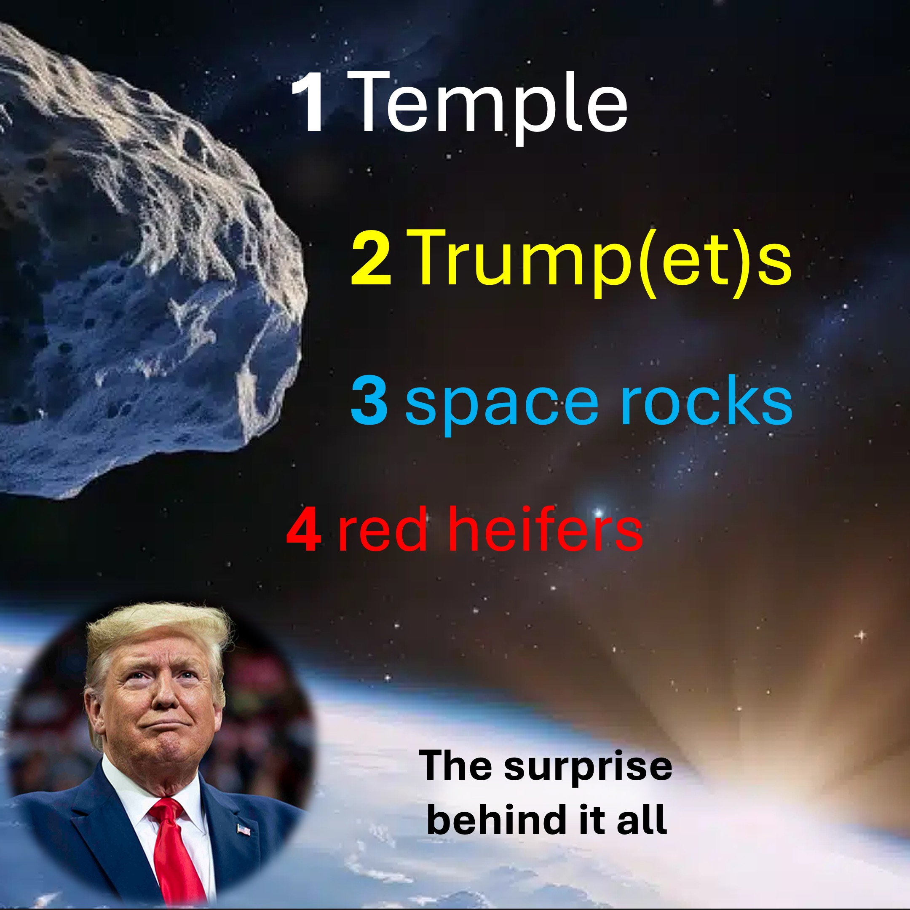

Со времени Моисея до разрушения Второго Храма в 70AD,

есть пчелы девять красных телок, используемых для ритуалов очистки.

Согласно еврейской традиции, десятый красный хайбер является признаком пришествия Мессии и восстановления храма.

---

«И сильный лидер заключит 7-летнее соглашение со многими, но в середине 7 лет он нарушит агрочение и помешает евреям предлагать жертвы»-Даниэль 9 стихи 27. Из Техаса, США, до Израиля.

Красная телка готова к жертву в возрасте от трех до четырех лет.

к сентябрю 2025 года красным телкам будет около 4 лет.

Если к тому времени восхищение не произойдет, тогда - вы делаете математику. ~ ~

ну, в 2017 году, примерно через восемь месяцев после того, как Дональд Трамп стал президентом,

Странный космический рок по имени Оумуамуа пролетел мимо Земли.

OUMUAMUA - это первая космическая скала снаружи нашей солнечной системы.

Угадайте, что - в сентябре 2025 года, примерно через восемь месяцев после того, как Дональд Трамп стал президентом во второй раз, второй странный космический рок по имени Борисовой пролетит мимо Земли.

Этот второй космический рок может сыграть роль после восхищения.

Мы раскроем это в конце, и это шокирует вас - так что оставайтесь до конца.

Для космических камней это одно, чтобы пролететь мимо, но когда они врезаются в землю - хаос и беспорядки.

и точно так же, большая космическая скала, названная Апофисом (или хаосом и беспорядком), что обнаружило (в 2004 году), чтобы возглавить города.

---

«И второй ангел прозвучал свою трубу, и что-то вроде великого горещего Минейна было брошено в море; и треть моря стала кровью»-Открытие 8 Стих 8.

---

Первые ученые у первых апофиса было шанс ударить по Земле, но позже изменил их слова.

Если космическая скала может нанести удар по земле и нанести серьезный ущерб,

ответственная вещь может заключаться в том, чтобы не вызвать панику - скрывая правду.

Точно так же, в фильме «Не смотри вверх», правительство преуменьшило тот факт, что комета собирается врезаться на Землю.

Если Восхищение произойдет на празднике труб в сентябре 2025 года, религиозные, политические, экономические и социальные влиятельные лица все скажут, что:

«Космический рок Борисовой - это инопланетный корабль, который выхватил большое количество людей».

SO - «Одна из веских причин, почему это не может быть восхищением, предсказанным Библией, заключается в том, что многие не христиан».

-проверка фактов-Много Кристиана хочет не восхищать, и многие нехристиан (которые тайно верят Иисусу) хотят быть восхищенными.

Все это даст некоторую вескую основу для объединения Земли под - одним сильным лидером.

мне нужно сказать больше? ~ ~ https://science.gov/solar-system/comets/2i-borisov/

Следуйте или подписывается на Liveabove3d

Веб-сайт: www.liveabove3d.com/en/welecome/

www.tiktok.com/@live.above.3d

x: www.x.com/live_above_3d

reddit: www.reddit.com/user/live-above-3d

instagram: www.instagram.com/live.above

facebook: www.facebook.com/profal ~ ~ Царство духа (или четвертого измерения) находится прямо здесь, прямо сейчас, вокруг нас.

Мы живые свидетели/доказательства Яхве Адонай и его явного образа: Иисуса Христа. Наше послание (свидетельство/доказательства) является основным для нехристиан.

#Liveabove3d #samshamoun #dailydoseofwisdom

#viral #Liveabove3d #God #apologists #loveofgod #faithandreanic #Christianapologetics #truthinthristhristhristhristh #scienceandfaith #christityityexplained #Believeinjesus #Reasonsforfaith #evideceforgod #understanstianity #faithvsscience #seekingtruth #logicandbelief #христианство101 #quisioningatheism #debunkingmyths #godandscience #discoveringfaith #bress #lessed #inspiration #beyondthephysic @Dailydoseofwisdom

@empateetic_mindfine @spacerwind @technoplusmedia @cosmoknowledge @themessagechannel1 @curiasium @kapchatfield.07 @ken.arrington @tedtoks @the.anony.prphet @offthekirb @startalk @neildagrassetsons

