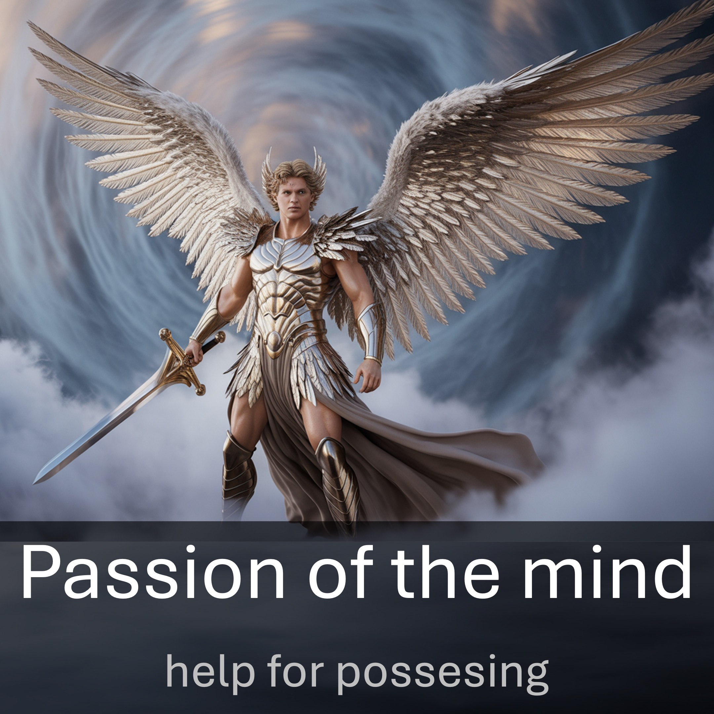

Remember when something happened and you just couldn’t let go?
Your mind went into overdrive.
You just couldn’t think of anything else, because something important (maybe your reputation) was at stake.
Troubled thoughts overshadowed everything for a few hours or even days.
In your mind, you replayed what happened over and over again, trying to make your case. 
The passion of the mind is very powerful.
Let’s switch things.
You pray and what you expect does not happen, despite all the promises of God.
Your mind should go into overdrive.
You should not go on with your life, when the Word of God in your life, is at stake.
You need to be deeply concerned for a few hours or even days.
You need to search the wisdom of God in spirit and in the written word and use it over and over again, to make your case.
Then the light will shine through.
And you shall have what you prayed for.
Why does it happen this way?
Because the Word of God builds you up; then gives you an inheritance.

#troubled #reputation #passion #mind #pray #wordofGod #wisdom #spirit #light #inheritance

BIBLE VERSES

And whatsoever ye shall ask in my name, that will I do, that the Father may be glorified in the Son. – John 13:13

Fight the good fight of faith, lay hold on eternal life, whereunto thou art also called, and hast professed a good profession before many witnesses. - 1 Timothy 6:12

And this voice which came from heaven we heard, when we were with him in the holy mount. We have also a more sure word of prophecy; whereunto ye do well that ye take heed, as unto a light that shineth in a dark place, until the day dawn, and the day star arise in your hearts: - 2 Peter 1: 18-19

Now I commit you to God and to the word of his grace, which can build you up and give you an inheritance among all those who are sanctified – Acts 20:32

LEARN MORE

Website: www.liveabove3d.com/en/welcome/

YouTube: www.youtube.com/@live.above.3d

TikTok: www.tiktok.com/@live.above.3d

X: www.x.com/live_above_3d

Reddit: www.reddit.com/user/live-above-3d

Instagram: www.instagram.com/live.above.3d

Facebook: www.facebook.com/profile/100092339087423423