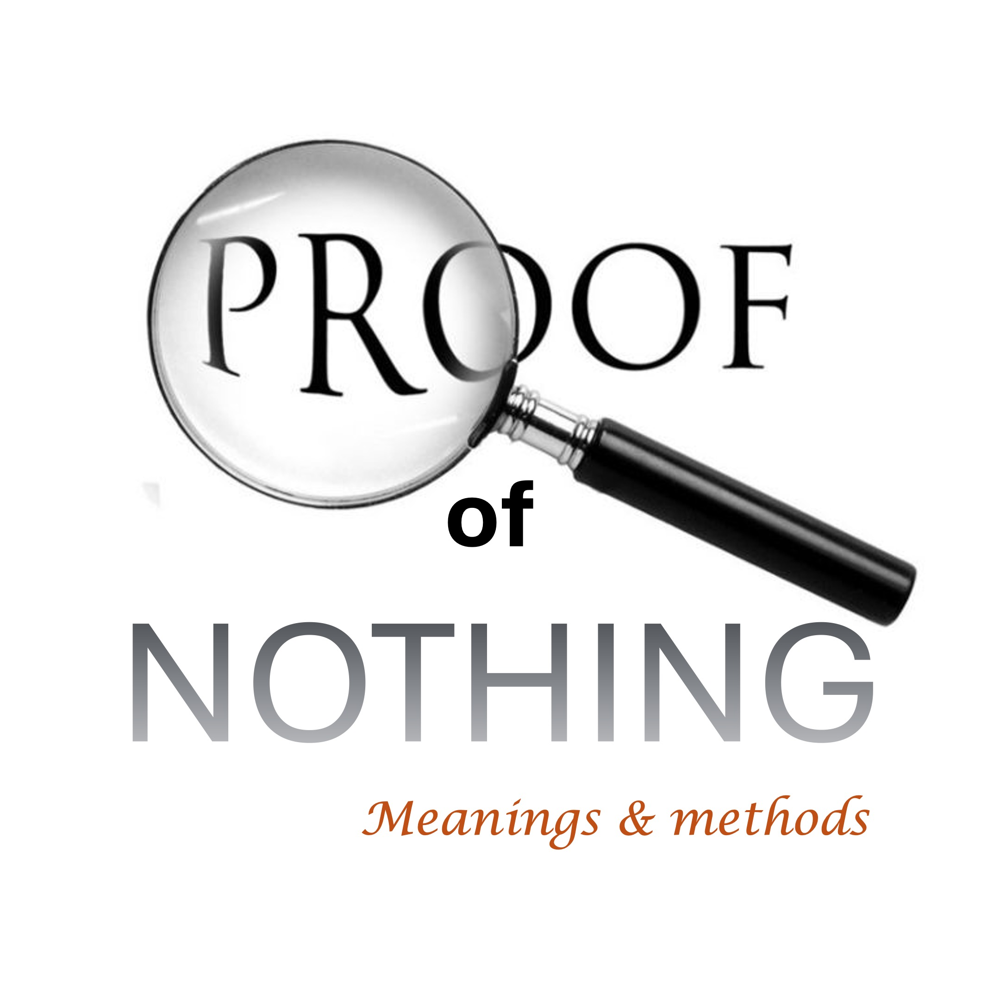

The Top Cancer Specialist Declares That Your Wife Will.

in faith, you declare that she will live to glorify god.

Faith is evidence.

Do you know that evidence is request only when the truth is being.

No One Needs Evidence that 1 Plus 1 IS 2, in Court.

in your case, evidence is request 99.9 percent of the time,

when the top specialist say that you are going to the - you will.

if you are blessed enough to find evidence that your wife will live,

go to court and make your case.

It’s a spiritual court, so make your case in your heart, by brooding on the evidence.

a person Brooding would be Seen Contending - Talking to Themelves.

at every turn repeat the evidence to counter thoughts of death.

here’s the important part.

Brood unil you begin to subconsciously blurt out the content of your heart.

Those words from the Heart are like the roar of a lion.

whatever you roar; Will Surely come to pass.

#death #faith #evidence #court #brood #roar #joshua1: 8 #james5: 16

Bible verses

Now faith is the substance of Things Hoped for, the evidence of things not lakes. - Hebrews 11: 1.

Bless the Lord, O My Soul, and Forget not all his benefits: Who Forgiveth All Thine Iniquities; Who Healeth All Thy Diseases; - Psalm 105: 2-3.

Is any sick among you? Let Him Call for the Elders of the Church; And Let Them Pray Over Him, Anointing Him with Oil in the Name of the Lord: And The Prayer of Faith Shall Save the Sick, And The Lord Shall Raise Him Up; and if he have committed sins, they shall be forgive him. - James 5: 14-15
Who own self bare our sins in his own body on the Tree, that we, Being dead to sins, should live unfo to right: by whose stripes ye healed. - 1 Peter 2:24.

The Heart of the Righteous Studieth to Answer: But the Mouth of the Wicked Poureth Out Evil Things. - Proverbs 15:28.

This Book of the Law Shall Not Depart Out of Thy Mouth; But thou shalt meditate thermein day and night, that thou Mayest Observe to do according to all that is written thermal: for then thou shalt make thy way prosperous, and then thou shalt have good success. - Joshua 1: 8

Confess your faults one to another, and pray one for another, that ye may be healed. The Effectual Fervent Prayer of a Righteous Man Availeth Much. - James 5:16

The Intense, Passionate, Deep and Sincere Prayer of a Believer Makes Much Power Available. - James 5: 16b paraphrased.